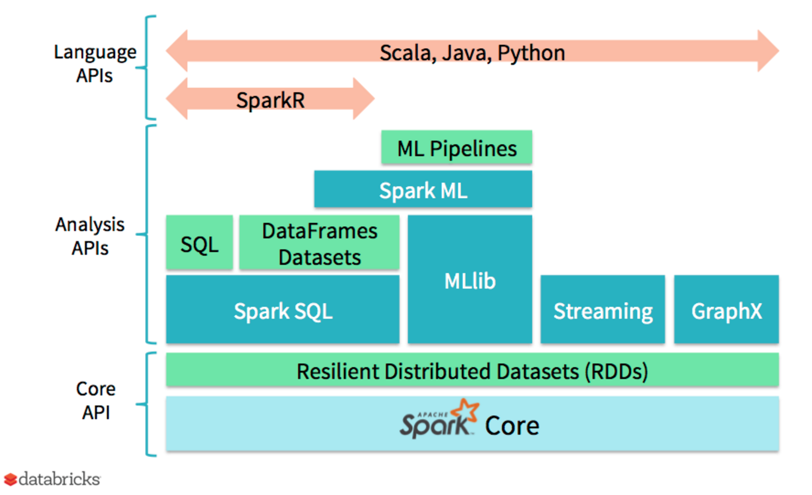

```{r setup, include=FALSE}
options(htmltools.dir.version = FALSE)
library(knitr)
```

```{css}
.callout-bold strong {
  font-weight: normal;
  color: #444444;
  background-color: #FFFFAA;
}
.hljs-keyword {
  font-weight: normal !important;
}
th {
  text-align: left;
}
td, th {
  padding: 3px 20px 3px 0;
}
```


## Apache Spark Core



---

## R and Spark Became Intimate Friends in 2016

+ Last year was an exciting year for the R APIs for Spark:

--

1. [`SparkR`, 1.6 -> 2.0](https://spark.apache.org/docs/2.0.0/sparkr.html)
  - Greater adoption of SparkML algorithms
  - Introduction of user-defined functions/functionals
      * `spark.lapply`, `dapply`, `gapply`, `gapply.collect`
      * apply a user-defined function to each partition or group of a Spark DataFrame
      * each group _must_ fit in the driver memory
  - Issues: Doesn't play well with `dplyr`
--

2. [`sparklyr`](spark.rstudio.com)
  - A complete _tidy_ interface to Spark
  - Works seamlessly with `dplyr`
  - IDE support to view Spark DataFrames and manage Spark connections
  - Custom R UDFs are still in development ([#81](https://github.com/rstudio/sparklyr/issues/81))
  - Awesome extension mechanism
--

3. [R Server on Spark](https://docs.microsoft.com/en-us/azure/hdinsight/hdinsight-hadoop-r-server-get-started)
  - Fully managed Hadoop/Spark on the cloud
  - Deploy `RevoScaleR` algorithms into Spark clusters
      * Complete support for all the PEMA modeling functions in `RevoScaleR`
---

## Azure HDInsight
### Full Managed Hadoop/Spark on the Cloud

+ With Azure HDInsight, you don't have to choose between the APIs
+ Can use any combination of the APIs for your data science application
+ Focus less on optimizing code, rewriting your functions, and focus more on developing applications
+ HDInsight R Server clusters ship with RStudio Server
+ You can add additional nodes to scale your cluster out, shrink it down when you don't need the extra resources
+ Run your own R functions across your cluster in paralle using `rxDataStep`, `rxExec` and `foreach`

---

## Understanding Spark as an R User

Core components of Spark (left) and how to think about them as R programmers (right):
--

.pull-left[
1. RDD;

1. DataFrame;

1. Transformers;
  - a function that takes a RDD/DataFrame in and pushes another RDD/DataFrame out

1. Actions;
  - a function that takes a RDD/DataFrame in, and puts anything else out

]
--

.pull-right[
1. Distributed immutable `list`;

1. Distributed `data.frame`;

1. Lazy Computations;

  <br>
  <br>
  <br>
  <br>
  
1. Eager Queries;

]
---

background-image: url(http://i.imgur.com/5GbW690.gif)
background-size: 1200px
background-position: 50% 50%
class: center, bottom, inverse


# The Art of Being Lazy
---

## How To Use Spark Effectively with R


1. Apache Spark's core computational framework is a functional programming paradigm for building DAGs (distributed acyclical graphs) for the data processing job at hand
--

  - DAGs contain the logical flow of how data is used to compute the result
  - Spark optimizes computations within a Spark job by __caching__ data
--

1. Every job in Spark is split into:
  - _stages_
      * basic physical unit of operation
--
      * combination of as many transformations as possible into a single action, but no shuffles
--
      * unlike mapreduce, which only supports two-stages (map and reduce), any Spark job could have multiple stages that can run concurrently
--
  - _tasks_
      * basic unit of operation per partition
--
1. When you need to reuse data across different Spark jobs, __cache__ the Spark DataFrame so you can reuse it
--

1. When you have data you have worked hard on tidying, save it to an efficient format, like _parquet_

---

## `sparklyr` 
### Tidy Data Manipulation in Spark

* `sparklyr` makes common `tidyverse` operations very simple
    - also, `spark_install` will save you from hair-loss!
* Full support for `SparkML`


```{r sparklyr, eval = FALSE, cache = FALSE}

origins <- file.path("wasb://mrs-spark@alizaidi.blob.core.windows.net",
                     "user/RevoShare/alizaidi/Freddie/Acquisition")
library(sparklyr)
sc <- spark_connect("yarn-client")
freddie_origins <- spark_read_csv(sc,
                                  path = origins,
                                  name = 'freddie_origins',
                                  header = FALSE,
                                  delimiter = "|"
                                  )

```
---

## `sparklyr` 
### Tidy Data Manipulation in Spark

```{r}
freddie_origins
```

---
## `sparklyr` 
### Tidy Data Manipulation in Spark

```{r}
class(freddie_origins)

```

--

+ `tbl_spark` inherits `dplyr` methods from `tbl_sql`
+ Spark SQL supports a subset of the SQL-92 language, so not all your SQL statements will work
    - actually using the Hive Context, which supports a richer subset
  
---

## `sparklyr` 
### Using `dplyr` with `tbl_spark`

```{r rename}
library(dplyr)
freddie_rename <- freddie_origins %>% rename(
                          credit_score = V1,
                          first_payment = V2,
                          first_home = V3,
                          maturity = V4,
                          msa = V5,
                          mi_perc = V6,
                          num_units = V7,
                          occ_status = V8,
                          cltv = V9,
                          dti = V10,
                          upb = V11,
                          ltv = V12,
                          orig_rate = V13,
                          channel = V14,
                          ppm = V15,
                          prod_type = V16,
                          state = V17,
                          prop_type = V18,
                          post_code = V19,
                          loan_number = V20,
                          loan_purpose = V21,
                          orig_term = V22,
                          num_borrowers = V23,
                          seller = V24,
                          servicer = V25
                          )
freddie_rename %>% head
```
---

## Create Date Fields

The origination date is buried inside the loan number field. We will pick it out by indexing the loan number substring:

```{r select}
freddie_rename %>% select(loan_number)

```
---

## Substring Operations

```{r orig_year}
freddie_rename <- freddie_rename %>% 
  mutate(orig_date = substr(loan_number, 3, 4),
         year = as.numeric(substr(loan_number, 3, 2)))

freddie <- freddie_rename %>% 
  mutate(orig_year = paste0(ifelse(year < 10, "200", 
                                   ifelse(year > 16, "19",
                                          "20")), year))

freddie <- freddie %>% 
  mutate(orig_year = substr(orig_year, 1, 4))

freddie %>% head
```
---

## Calculate Average Credit Score by Year


```{r avg_fico}

fico_year <- freddie %>% group_by(orig_year, state) %>% 
  summarise(ave_fico = mean(credit_score)) %>% collect
fico_year %>% head

```
---

## Summarize In a Function

```{r avg_var}

year_state_sum <- function(val = "credit_score") {
  
  library(lazyeval)
  
  year_state <- freddie %>% group_by(orig_year, state) %>% 
    summarise_(sum_val = interp(~mean(var), var = as.name(val)))
  
  year_state <- year_state %>% collect
  
  names(year_state)[3] <- paste0("ave_", val)
  
  return(year_state)
  
}

```
---

## Plot

```{r state_choro_dti, eval = FALSE}

library(rMaps)
year_state_sum("dti") %>% 
  mutate(year = as.numeric(orig_year)) %>% 
  rMaps::ichoropleth(ave_dti ~ state, data = .,
                     animate = "year",
                     geographyConfig = list(popupTemplate = "#!function(geo, data) {
                                         return '<div class=\"hoverinfo\"><strong>'+
                                         data.state + '<br>' + 'Average DTI in  '+ data.year + ': ' +
                                         data.ave_dti.toFixed(2)+
                                         '</strong></div>';}!#")) -> state_map
```
---

class: inverse

## Thanks!

+ [spark.rstudio.com](spark.rstudio.com)
+ [github.com/Azure/mr4ds](https://github.com/Azure/mr4ds)
+ [Spark bookdown](https://bookdown.org/alizaidi/mrs-spark-ml/)