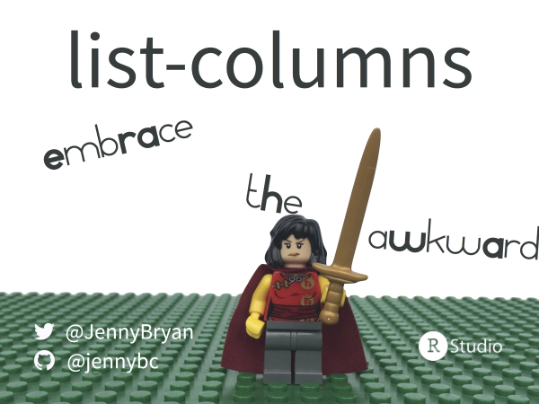

[rstudio::conf 2017](https://www.rstudio.com/conference/), Orlando

**Putting square pegs in round holes: Using list-cols in your dataframe**  
Jenny Bryan

PDF of slides:

  * Here in this repo: [2017-01_rstudio-conf-bryan-list-columns.pdf](2017-01_rstudio-conf-bryan-list-columns.pdf)
  * On [SpeakerDeck](https://speakerdeck.com/jennybc/putting-square-pegs-in-round-holes-using-list-cols-in-your-dataframe)
  
Related material:

  * <https://jennybc.github.io/purrr-tutorial/>
