```{r setup, echo=FALSE}
library(DiagrammeR)
library(magrittr)
```


## Customize Login Page

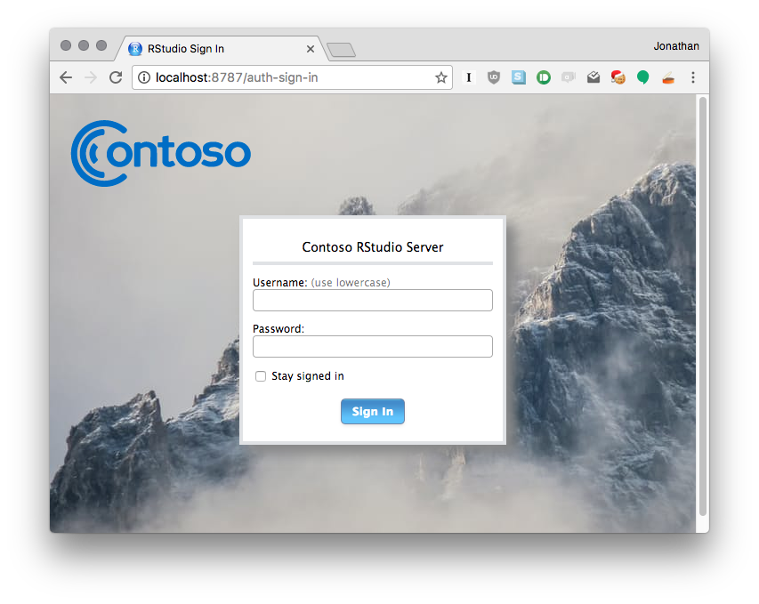

## Customize Login Page

Edit:

    /etc/rstudio/login.html

- Code is injected **after** the login box.
- Use CSS to position elements elsewhere on the page
- Use JS to modify the page

## High Availability 

- Use multiple RStudio Server Pro instances as failovers for each other
- Provide service to analysts even if one or more machines are down
- Supported using RStudio Server Pro "Multiple Masters" load balanced configuration

## High Availability 

```{r, echo=FALSE}
grViz(diagram="high-availability.gv")
```

## Log everything that goes to the R console

    session_id, project, pid, username, timestamp, type, data
    125a3b4f, "", 28519, "rstudiouser", 1483482800226, prompt, "> "
    125a3b4f, "", 28519, "rstudiouser", 1483482818498, input, "demo(package = .packages(all.available = TRUE))"
    125a3b4f, "", 28519, "rstudiouser", 1483482818559, prompt, "> "
    125a3b4f, "", 28519, "rstudiouser", 1483482826169, input, "demo(nlm)"
    125a3b4f, "", 28519, "rstudiouser", 1483482826176, output, "\n\n        demo(nlm)\n     ---- ~~~\n"
    125a3b4f, "", 28519, "rstudiouser", 1483482827311, input, ""
    125a3b4f, "", 28519, "rstudiouser", 1483482827319, output, "\n> #  Copyright (C) 1997-2009 The R Core Team\n> \n> ### Helical Valley Function\n> ### Page 362 Dennis + Schnabel\n> \n> require(stats); require(graphics)\n\n> theta <- function(x1,x2) (atan(x2/x1) + (if(x1 <= 0) pi else 0))/ (2*pi)\n\n> ## but this is easier :\n> theta <- function(x1,x2) atan2(x2, x1)/(2*pi)\n\n> f <- function(x) {\n+     f1 <- 10*(x[3] - 10*theta(x[1],x[2]))\n+     f2 <- 10*(sqrt(x[1]^2+x[2]^2)-1)\n+     f3 <- x[3]\n+     return(f1^2+f2^2+f3^2)\n+ }\n\n> ## explore surface {at x3 = 0}\n> x <- seq(-1, 2, length.out=50)\n\n> y <- seq(-1, 1, length.out=50)\n\n> z <- apply(as.matrix(expand.grid(x, y)), 1, function(x) f(c(x, 0)))\n\n> contour(x, y, matrix(log10(z), 50, 50))\n"
    125a3b4f, "", 28519, "rstudiouser", 1483482827443, prompt, "Hit <Return> to see next plot: "
    125a3b4f, "", 28519, "rstudiouser", 1483482828392, input, ""
    125a3b4f, "", 28519, "rstudiouser", 1483482828434, output, "\n> str(nlm.f <- nlm(f, c(-1,0,0), hessian = TRUE))\nList of 6\n $ minimum   : num 1.24e-14\n $ estimate  : num [1:3] 1.00 3.07e-09 -6.06e-09\n $ gradient  : num [1:3] -3.76e-07 3.49e-06 -2.20e-06\n $ hessian   : num [1:3, 1:3] 2.00e+02 -4.07e-02 9.77e-07 -4.07e-02 5.07e+02 ...\n $ code      : int 2\n $ iterations: int 27\n\n> points(rbind(nlm.f$estim[1:2]), col = ""red"", pch = 20)\n\n> ### the Rosenbrock banana valley function\n> \n> fR <- function(x)\n+ {\n+     x1 <- x[1]; x2 <- x[2]\n+     100*(x2 - x1*x1)^2 + (1-x1)^2\n+ }\n\n> ## explore surface\n> fx <- function(x)\n+ {   ## `vectorized' version of fR()\n+     x1 <- x[,1]; x2 <- x[,2]\n+     100*(x2 - x1*x1)^2 + (1-x1)^2\n+ }\n\n> x <- seq(-2, 2, length.out=100)\n\n> y <- seq(-0.5, 1.5, length.out=100)\n\n> z <- fx(expand.grid(x, y))\n\n> op <- par(mfrow = c(2,1), mar = 0.1 + c(3,3,0,0))\n\n> contour(x, y, matrix(log10(z), length(x)))\n"
    125a3b4f, "", 28519, "rstudiouser", 1483482828549, prompt, "Hit <Return> to see next plot: "
    125a3b4f, "", 28519, "rstudiouser", 1483482829218, input, ""
    125a3b4f, "", 28519, "rstudiouser", 1483482829295, output, "\n> str(nlm.f2 <- nlm(fR, c(-1.2, 1), hessian = TRUE))\nList of 6\n $ minimum   : num 3.97e-12\n $ estimate  : num [1:2] 1 1\n $ gradient  : num [1:2] -6.54e-07 3.34e-07\n $ hessian   : num [1:2, 1:2] 802 -400 -400 200\n $ code      : int 1\n $ iterations: int 23\n\n> points(rbind(nlm.f2$estim[1:2]), col = ""red"", pch = 20)\n\n> ## Zoom in :\n> rect(0.9, 0.9, 1.1, 1.1, border = ""orange"", lwd = 2)\n\n> x <- y <- seq(0.9, 1.1, length.out=100)\n\n> z <- fx(expand.grid(x, y))\n\n> contour(x, y, matrix(log10(z), length(x)))\n\n> mtext(""zoomed in"");box(col = ""orange"")\n\n> points(rbind(nlm.f2$estim[1:2]), col = ""red"", pch = 20)\n\n> par(op)\n\n> fg <- function(x)\n+ {\n+     gr <- function(x1, x2) {\n+         c(-400*x1*(x2 - x1*x1)-2*(1-x1), 200*(x2 - x1*x1))\n+     }\n+     x1 <- x[1]; x2 <- x[2]\n+     res<- 100*(x2 - x1*x1)^2 + (1-x1)^2\n+     attr(res, ""gradient"") <- gr(x1, x2)\n+     return(res)\n+ }\n\n> nlm(fg, c(-1.2, 1), hessian = TRUE)\n$minimum\n[1] 1.182096e-20\n\n$estimate\n[1] 1 1\n\n$gradient\n[1]  2.583521e-09 -1.201128e-09\n\n$hessian\n        [,1]    [,2]\n[1,]  802.24 -400.02\n[2,] -400.02  200.00\n\n$code\n[1] 1\n\n$iterations\n[1] 24\n\n\n> ## or use deriv to find the derivatives\n> \n> fd <- deriv(~ 100*(x2 - x1*x1)^2 + (1-x1)^2, c(""x1"", ""x2""))\n\n> fdd <- function(x1, x2) {}\n\n> body(fdd) <- fd\n\n> nlm(function(x) fdd(x[1], x[2]), c(-1.2,1), hessian = TRUE)\n$minimum\n[1] 1.182096e-20\n\n$estimate\n[1] 1 1\n\n$gradient\n[1]  2.583521e-09 -1.201128e-09\n\n$hessian\n        [,1]    [,2]\n[1,]  802.24 -400.02\n[2,] -400.02  200.00\n\n$code\n[1] 1\n\n$iterations\n[1] 24\n\n\n> fgh <- function(x)\n+ {\n+     gr <- function(x1, x2)\n+         c(-400*x1*(x2 - x1*x1) - 2*(1-x1), 200*(x2 - x1*x1))\n+     h <- function(x1, x2) {\n+         a11 <- 2 - 400*x2 + 1200*x1*x1\n+         a21 <- -400*x1\n+         matrix(c(a11, a21, a21, 200), 2, 2)\n+     }\n+     x1 <- x[1]; x2 <- x[2]\n+     res<- 100*(x2 - x1*x1)^2 + (1-x1)^2\n+     attr(res, ""gradient"") <- gr(x1, x2)\n+     attr(res, ""hessian"") <- h(x1, x2)\n+     return(res)\n+ }\n\n> nlm(fgh, c(-1.2,1), hessian = TRUE)\n$minimum\n[1] 2.829175\n\n$estimate\n[1] -0.6786981  0.4711891\n\n$gradient\n[1] -0.4911201  2.1115987\n\n$hessian\n         [,1]     [,2]\n[1,] 366.1188 271.4593\n[2,] 271.4593 200.0000\n\n$code\n[1] 4\n\n$iterations\n[1] 100\n\n"
    125a3b4f, "", 28519, "rstudiouser", 1483482829500, prompt, "> "


## Log everything that goes to the R console

Set:

    audit-r-console=all
  
in `/etc/rstudio/rserver.conf`. It's also possible to log input only (specify `input` rather than `all`)

## Try a new version of R


## Try a new version of R

1. Compile new version of R 
1. Put in a well-known location such as `/opt/R`, or add path to `/etc/rstudio/r-versions`
1. Restart RStudio Server Pro

## Choose project when signing in

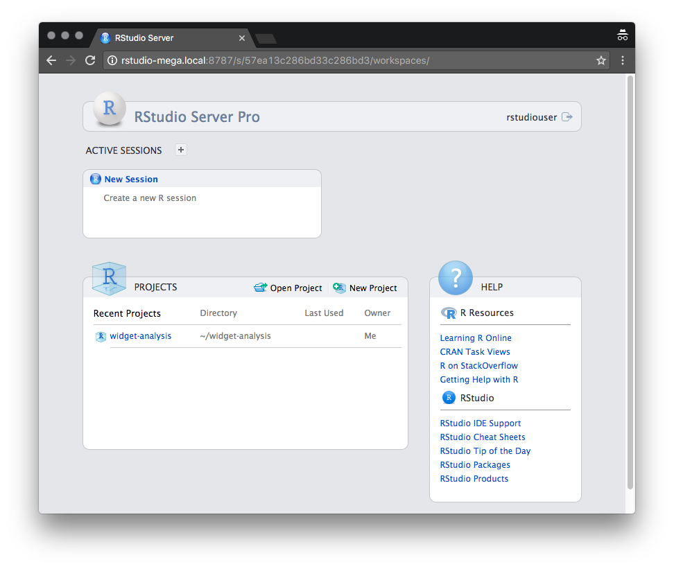

## Choose project when signing in

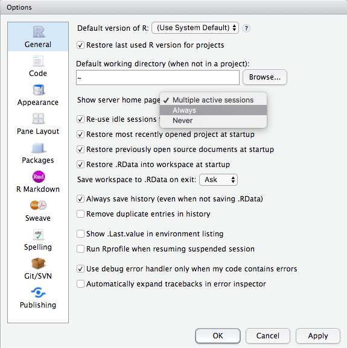

## Get notified when RSP goes down


## Get notified when RSP goes down

1. Enable health check with `server-health-check-enabled=1`
1. Install infrastructure monitoring tool such as Nagios and point it to health check
1. Configure notifications

## Customize session launch

1. Set environment variables
1. Configure access to clusters
1. Mount folders with data 
1. Etc.

## Customize session launch

Method 1: Modify

    /etc/rstudio/rsession-profile
    
Method 2: Set

    rsession-exec-command=your-script

## Disable publishing and downloading

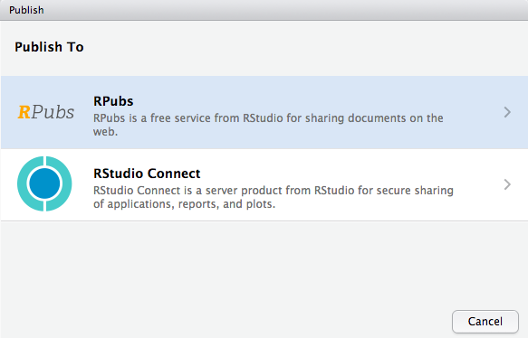

## Disable publishing and downloading

Set these options in `/etc/rstudio/rsession.conf`:

    allow-file-downloads=0
    allow-external-publish=0

## Give power users priority


## Give power users priority

Set in `/etc/rstudio/profiles`:

    [*]
    cpu-affinity = 1-4
    max-processes = 100
    max-memory-mb = 2048
    session-timeout-minutes=60
    
    [@powerusers]
    cpu-affinity = 5-16
    nice = -10
    max-memory-mb = 4096

## Use a project-specific version of R


## Use a project-specific version of R

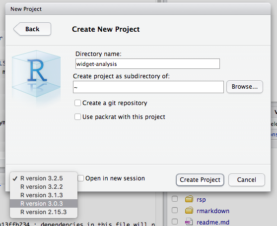

## Store new projects outside home dir


## Store new projects outside home dir

In `/etc/rstudio/rsession.conf`:

    session-default-new-project-dir=/mnt/bigdisk/projects
    
Also, consider setting `R_USER`, which allows customization of your "user home dir" as seen by R.

## Stable mapping of users to load balanced nodes

```{r, echo=FALSE}
grViz(diagram="cityhash.gv")
```

## Stable mapping of users to load balanced nodes

In `/etc/rstudio/load-balancer`

    [config]
    balancer = user-hash

## Impersonate a user


## Impersonate a user

    admin-superuser-group=rstudio-super-users

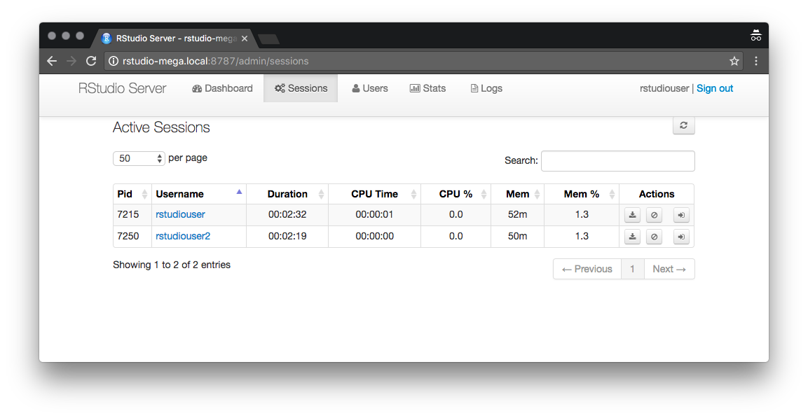

## Set default settings for new users

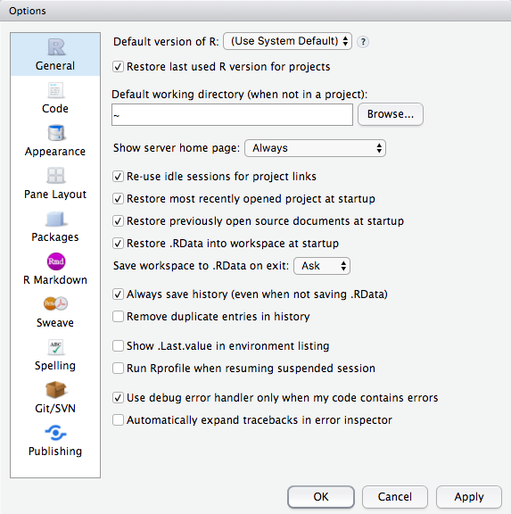

## Set default settings for new users

1. Set the settings you want in a user account
1. Extract them from the user's `~/.rstudio/monitored/user-settings` folder
1. Copy to `/etc/skel`

## Log R session activity

    pid, username, timestamp, type, data
    28450, "rstudiouser", 1483482767000, auth_login, ""
    28519, "rstudiouser", 1483482769000, session_start, ""
    28450, "rstudiouser", 1483484148000, auth_login, ""
    28450, "rstudiouser", 1483484258000, auth_logout, ""
    28450, "rstudiouser", 1483484265000, auth_login, ""
    28450, "rstudiouser", 1483484277000, auth_logout, ""
    28450, "rstudiouser", 1483484283000, auth_login_failed, ""
    28450, "rstudiouser", 1483484287000, auth_login, ""
    28519, "rstudiouser", 1483484297000, session_quit, ""
    28519, "rstudiouser", 1483484297000, session_exit, ""
    28796, "rstudiouser", 1483484308000, session_start, ""
    28796, "rstudiouser", 1483484317000, session_quit, ""
    28796, "rstudiouser", 1483484317000, session_exit, ""
    28835, "rstudiouser", 1483484318000, session_start, ""
    28835, "rstudiouser", 1483484321000, session_quit, ""
    28835, "rstudiouser", 1483484321000, session_exit, ""
    28871, "rstudiouser", 1483485057000, session_start, ""

## Log R session activity

In `/etc/rstudio/rserver.conf`:

    audit-r-sessions=1

## Immortal sessions


## Immortal sessions

In `/etc/rstudio/profiles`:

    [*]
    session-timeout-minutes=0

Can also designate specific groups or users who have immortal sessions.

## Open project in a new session

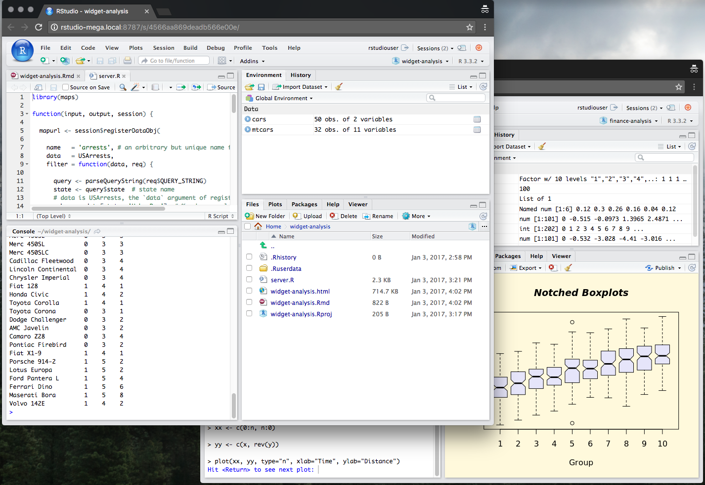

## Open project in a new session

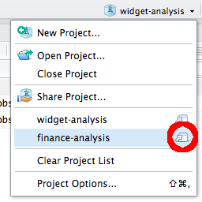

## See another session's output

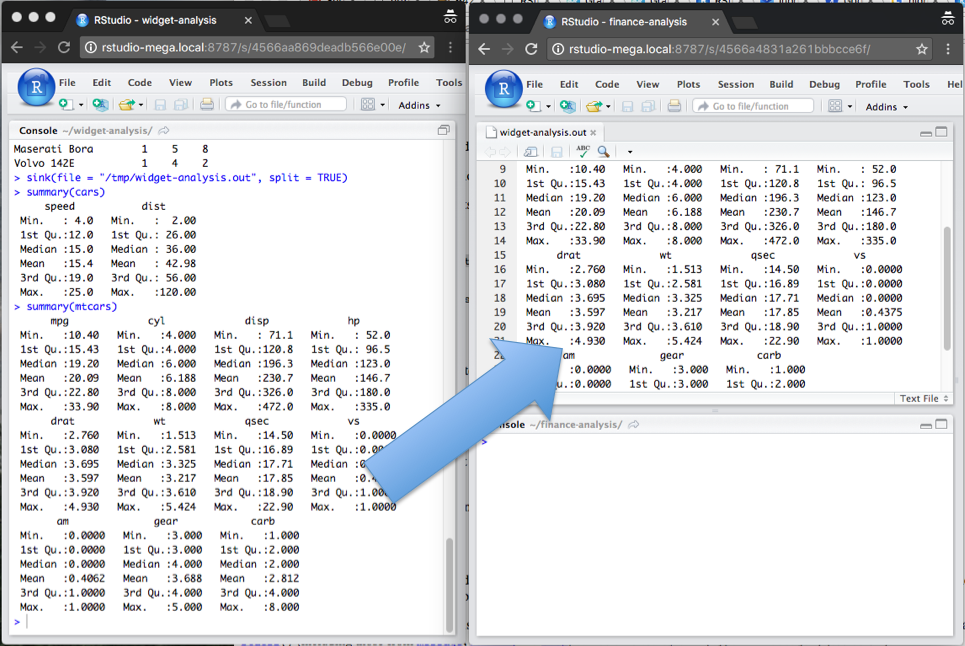

## See another session's output

1. Split the output stream from the source session with `sink(file = "/tmp/foo", split = TRUE)`
1. Open file as a source file in another session
1. See what your other session's up in one click and without leaving your current session window

With some modifications, this technique is also useful for consuming partial output of long-running processes.

## Graphite monitoring

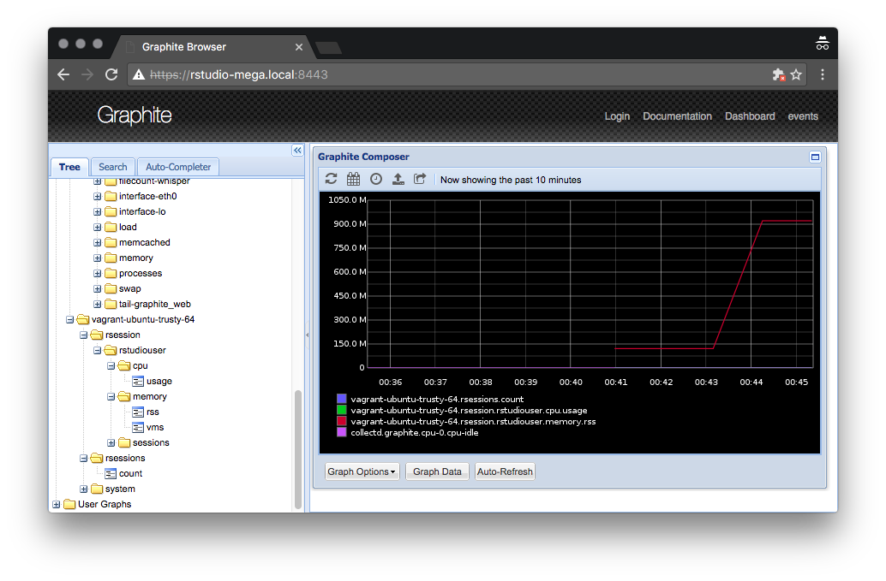

## Graphite monitoring

In `/etc/rstudio/rserver.conf`

    monitor-graphite-enabled=1
    monitor-graphite-host=134.47.22.6
    monitor-graphite-port=2003

## Pair program and code review 

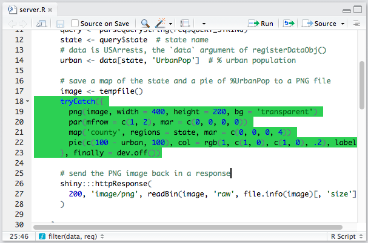

## Pair program and code review 

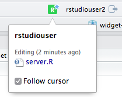

## The End


