## What We'll Cover

1. **Productivity**: Navigation and output tips
1. **Internals**: How R Notebooks *really* work
1. **Ecosystem**: Publishing, sharing, and version control

Basic familiarity with R Notebooks is presumed.

# Getting Work Done

## Notebook Recap


## Notebook Recap

- Notebooks are R Markdown documents + new interaction model
- Code chunks are executed individually 
- Code output appears beneath the chunk and is saved with the document 
- Combines iterative approach with reproducible result

## Notebook Recap

If you've never used them before, watch the [R Notebook Webinar](https://www.rstudio.com/resources/webinars/introducing-notebooks-with-r-markdown/)

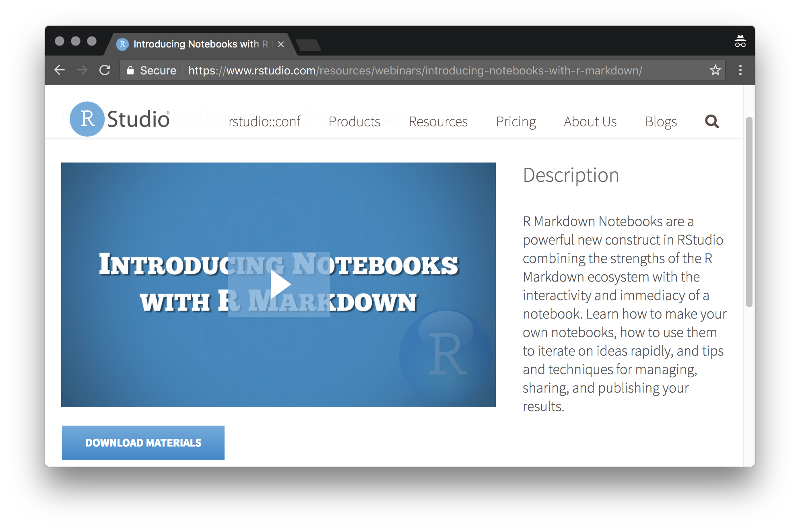

## Navigation: Outline

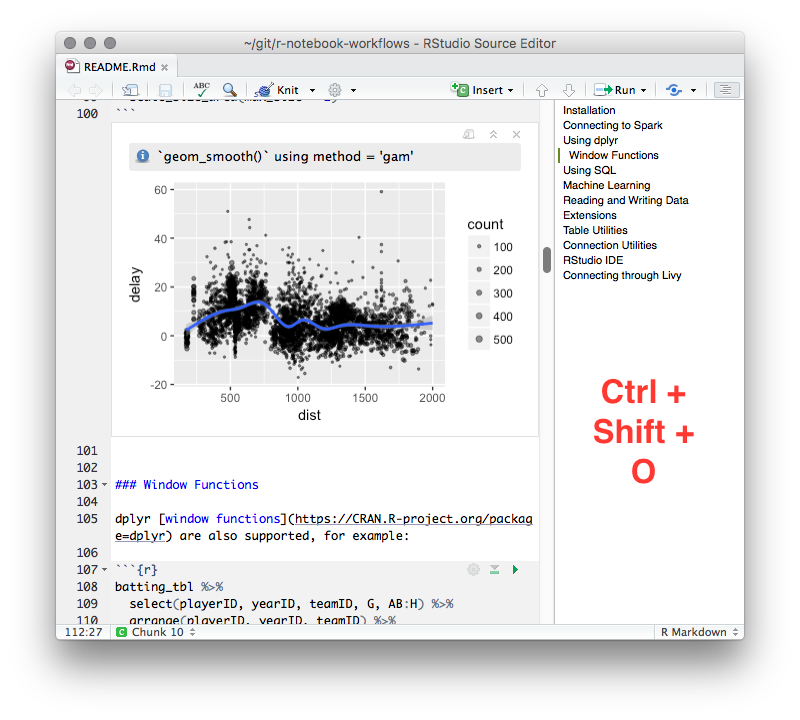

## Navigation: Jump To

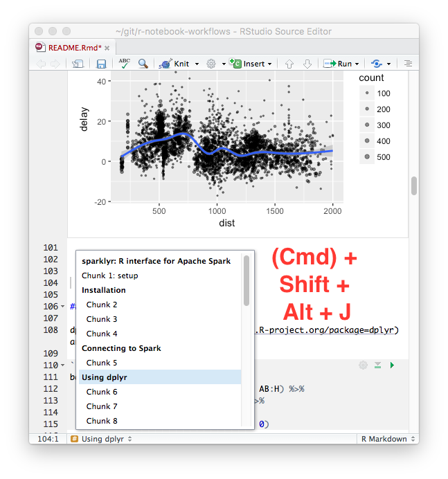

## Navigation: By Chunk

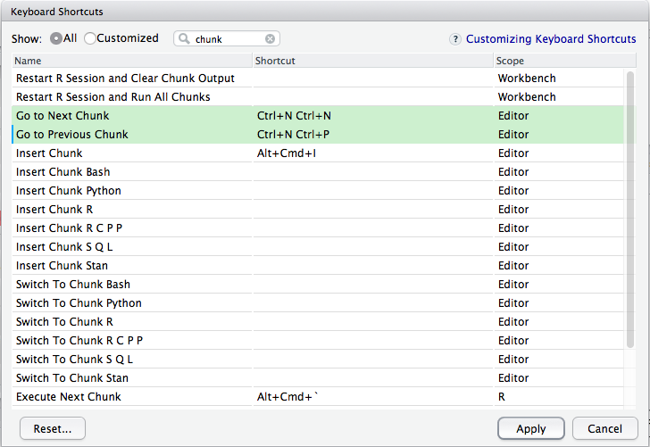

## Navigation: Running

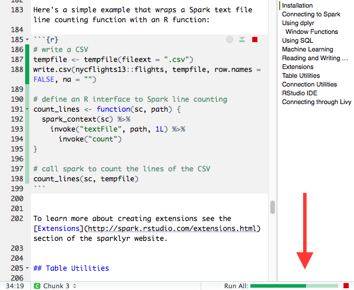

## Output Management

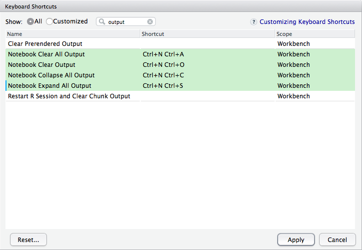

## Reproducibility

- Notebooks can be **less reproducible** than traditional R Markdown documents.
- Chunks can be run in **any order**. 
- Chunks can access the **global environment**.

## Simulating a Knit


## Consistency

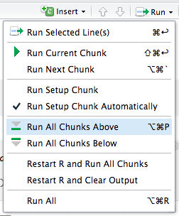

# How R Notebooks *Really* Work

## Input and Output

```{r, echo=FALSE}
DiagrammeR::grViz("notebook-io.gv")
```

## Input and Output

1. When you **execute** chunks in your notebook, the output is simultaneously displayed by RStudio and stored in a local cache in the `.Rproj.user` folder.
1. When you **save** your notebook, the output and your R Markdown document are combined into a single, self-contained `.nb.html` file.

# Publishing and Collaborating

## Publishing

Two choices:

1. Publish the notebook file directly (HTML)
1. Render to a separate output format

## Publishing: Notebook HTML

- Self-contained 
- Compatible with any hosting service
- No viewer required
- Hydrates to full notebook (more on this later)

## Publishing: Another Format

    ---
    title: "A Monte-Carlo Analysis of Monte Carlo"
    output:
      html_notebook: default
      pdf_document:
        fig_width: 9
        fig_height: 5
    ---

## Understanding Multiple Formats

```{r, echo=FALSE}
DiagrammeR::grViz("notebook-formats.gv")
```

## Publishing: RStudio Connect

- One-click publish inside your org
- Fine-grained access control
- Execute on the server
- Schedule executions 

## Collaborating: Plain Files

    To: analyst@contoso.com
    From: customer@northwind.com
    
    I need some help with this analysis. Could you 
    take a look at what I have so far?
    
    Thanks,
    Charles
    
    [ Attachment: foo.nb.html ]

## Collaborating: Execution in Reverse

```{r, echo=FALSE}
DiagrammeR::grViz("nb-hydration.gv")
```

## Collaborating: Opening Code in RStudio

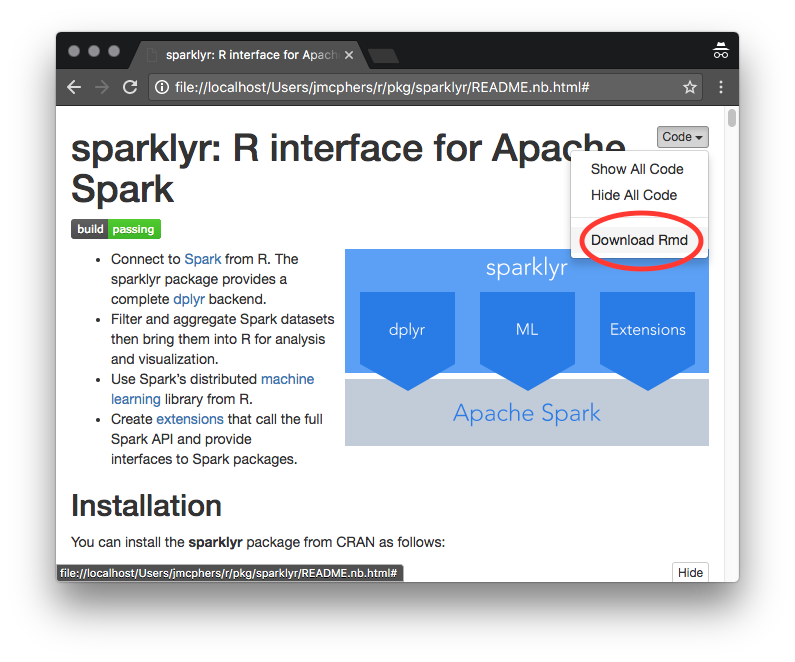


## Collaborating: Opening Notebook in RStudio


## Collaborating: Open Inside RStudio

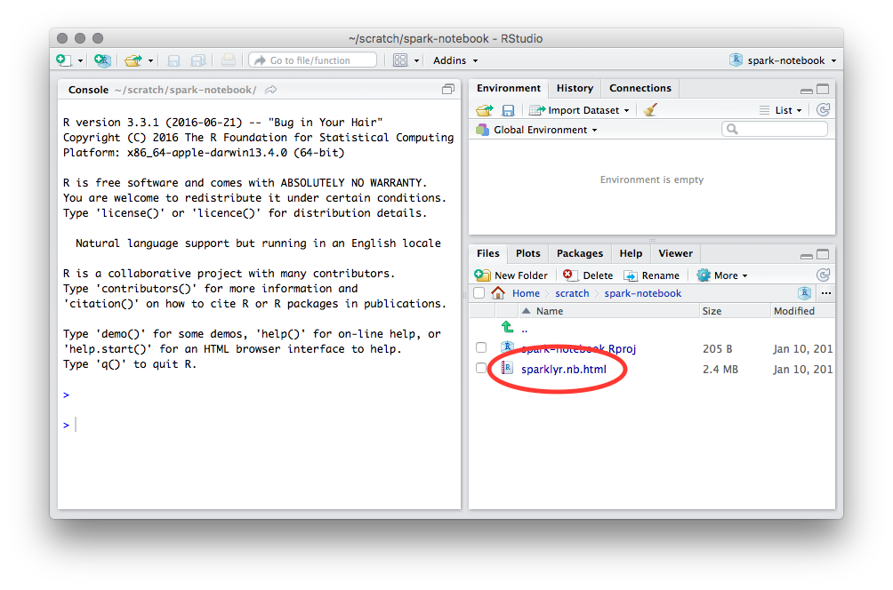

## Collaborating: Open Notebook

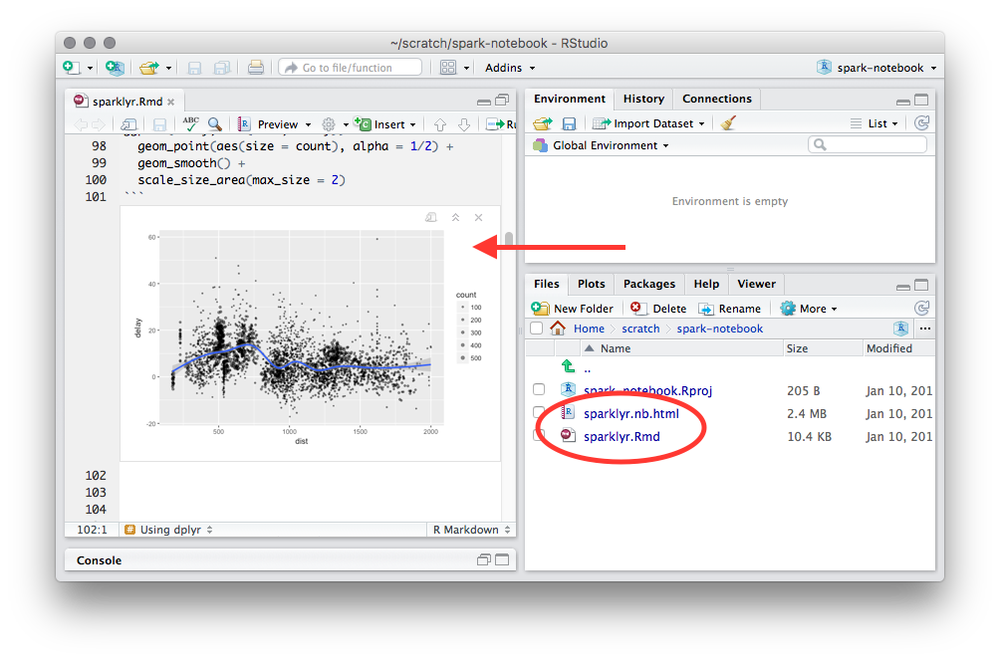

## Collaborating: Version Control #1

- Add `*.nb.html` to your `.gitignore` or similar
- Check in only the `.Rmd` file
- All diffs are plain text
- Encourages reproducibility & independent verification of results

## Collaborating: Version Control #2

- Check in the `.nb.html` file and the `.Rmd` file
- Diffs are noisier
- RStudio loads outputs from `.nb.html` if newer
- Outputs and inputs are versioned together
- No need to re-execute lengthy or fragile computations

## Versioned Output

When a notebook is opened:

- The local cache modified time is compared to the `.nb.html` 
- If `.nb.html` is older, it is ignored
- If `.nb.html` is newer, it replaces the local cache
- No merging or conflict management is performed!

## The End

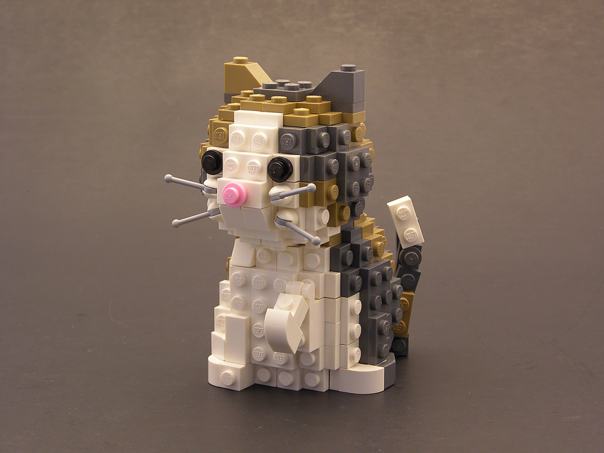


