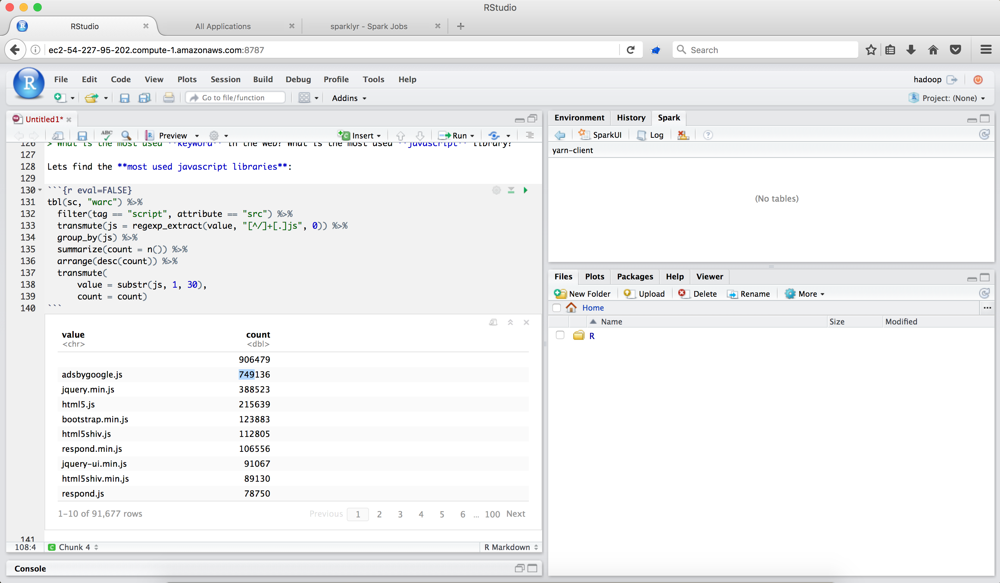

# Quick Recap!

## Apache Spark

> What is the most used **keyword** or **library** in the web?

- 1 trillion pages
- Sampling of 0.01%
- 100 machines with 10GB RAM

<div class="build">
[Apache Spark](http://spark.apache.org/) is a fast and general engine for large-scale data processing, with support for in-memory datasets.
</build>

## sparklyr - R interface for Spark

<div class="build sparklyr-code">
```{r eval=FALSE}
spark_install()                             # Install Apache Spark
sc <- spark_connect(master="local")         # Connect to local instance
```
</div>
<div class="build sparklyr-code">
```{r eval=FALSE}
library(dplyr)                              # Data Manipulation Grammar
mtcars_tbl <- copy_to(sc, mtcars)           # Copy mtcars into Spark
mtcars_tbl %>% summarize(n = n())           # Count records
```
</div>
<div class="build sparklyr-code">
```{r eval=FALSE}
mtcars_tbl %>% ml_linear_regression(        # Perform linear regression
  response = "mpg",                         # Response vector
  features = c("wt", "cyl"))                # Features for the model fit
```
</div>
<div class="build sparklyr-code">
```{r eval=FALSE}
library(DBI)                                # R Database Interface
dbGetQuery(sc, "SELECT * FROM mtcars")      # Run SQL query in Spark
```
</div>
<div class="build sparklyr-code">
```{r eval=FALSE}
invoke(spark_context(sc), "version")        # Run sc.version in Scala
compile_package_jars()                      # Compile Scala code
```
</div>
## sparklyr - 0.5 on CRAN!

- **New functions**: sdf_quantile(), ft_tokenizer() and ft_regex_tokenizer().
- **Improved compatibility**: na.action, dim(), nrow() and ncol().
- **Extended dplyr**: do() and n_distinct().
- **Experimental Livy** support.
- **Improved connections**.
- **Certified with Cloudera**.

# Queries with sparklyr, at scale!

## Connecting to Spark

```{r message=F, warning=F}
devtools::install_github("javierluraschi/sparkwarc") # Install sparkwarc from github

library(sparkwarc)                                   # sparklyr extension to read warcs
library(sparklyr)                                    # load sparklyr
library(dplyr)                                       # load dplyr
library(DBI)                                         # load DBI

config <- spark_config()                             # Create a config to tune memory
config[["sparklyr.shell.driver-memory"]] <- "10G"    # Set driver memory to 10GB

sc <- spark_connect(                                 # Connecto to spark
  master = "local",                                  # using local cluster
  version = "2.0.1",                                 # and Spark 2.0.1
  config = config)                                   # setting custom configs
```

## Importing from CommonCrawl

```{r}
warc_small <- system.file("samples/sample.warc",    # Find a sample.warc file 
                          package = "sparkwarc")    # from the sparkwarch package

warc_big <- "cc.warc.gz"                            # Name a 5GB warc file
if (!file.exists(warc_big))                         # If the file does not exist
  download.file(                                    # download by
    gsub("s3n://commoncrawl/",                      # mapping the S3 bucket url
         "https://commoncrawl.s3.amazonaws.com/",   # into a adownloadable url
         sparkwarc::cc_warc(1)), warc_big)          # from the first archive file

spark_read_warc(                                    # Read the warc file
  sc,                                               # into the sc Spark connection
  "warc",                                           # save into 'warc' table
  warc_big,                                         # load warc_url or warc_small
  repartition = 8,                                  # maximize cores
  parse = TRUE                                      # load tags as table
)
```

## Counting HTML Tags and Attributes

```{r}
tbl(sc, "warc") %>%                                 # From the CommonCrawl table
  summarize(count = n())                            # count html attributes and tags
```

## Total Pages

```{r}
tbl(sc, "warc") %>%                                 # From the CommonCrawl table
  filter(tag == "WARC-Target-URI") %>%              # keep only the URLs wark tag
  summarize(total = n())                            # get the count
```

## Top Sites

```{r max.print = 100}
top_sites <- tbl(sc, "warc") %>%                    # From the CommonCrawl table
  filter(tag == "WARC-Target-URI") %>%              # over the URLs in the warc file
  transmute(site = regexp_extract(                  # use a regular expression
    value,                                          # over the value of the URL
    ".*://(www\\.)?([^/]+).*",                      # to extract only the domain name
    2)) %>%                                         # which is found in the 2nd (),
  group_by(site) %>%                                # then group by site
  summarize(count = n()) %>%                        # and get the count of sites
  arrange(desc(count))                              # arranged top to bottom
```

## Top Sites

```{r max.print = 100}
top_sites
```

## What is the most used library?

```{r}
top_libraries <- tbl(sc, "warc") %>%                # From the CommonCrawl table
  filter(tag == "script",                           # over the <script> tags
         attribute == "src") %>%                    # that have a src attribute,
  transmute(library = regexp_extract(               # use a regular expression
    value,                                          # over the value of the src
    "[^/]+[.]js", 0)) %>%                           # to extract library.js,
  group_by(library) %>%                             # then group by library
  summarize(count = n()) %>%                        # and get the total count
  arrange(desc(count)) %>%                          # arranged top to bottom
  filter(library != "",                             # excluding empty entries
         length(library) < 30)                      # or entries that are long
```

## What is the most used library?

```{r max.print = 100}
top_libraries
```

## What is the most used keyword?

```{r}
top_keywords <- tbl(sc, "warc") %>%                 # From the CommonCrawl table
  filter(tag == "meta",                             # over the <meta> tags
         attribute == "content",                    # with a content attribute
         original %like% "%keywords%") %>%          # and a keywords attribute,
  transmute(keyword = explode(                      # make each element a row
    split(value, ",")) ) %>%                        # for words between commas,
  transmute(keyword = trim(keyword)) %>%            # removing whitespaces and
  filter(keyword != "") %>%                         # excluding empty entries,
  group_by(keyword) %>%                             # then group by library
  summarize(count = n()) %>%                        # and get the total count
  arrange(desc(count)) %>%                          # arranged top to bottom
  filter(!keyword %like% "%�%",                    # or any unknown characters
         length(keyword) < 30)                      # or entries that are too long
```

## What is the most used keyword?

```{r max.print = 100}
top_keywords
```

## Running at scale in EMR



<br>
[Analyzing 4 Billion Tags with R and Spark](http://rpubs.com/jluraschi/billion-tags)

# Thank you!

<style>
.pagedtable { opacity: 1 !important; }
.prettyprint {
  background-color: #fff9ee;
  border-left: solid 20px #ffa300;
}
.pagedtable-indexes { width: 240px; }
.sparklyr-code:nth-of-type(2) > pre {
  background-color: #96fff1;
  border-left: solid 20px #5fa300;
}
.sparklyr-code:nth-of-type(3) > pre {
  background-color: #e5faff;
  border-left: solid 20px #887bef;
}
.sparklyr-code:nth-of-type(4) > pre {
  background-color: #e5faff;
  border-left: solid 20px #ff5fa9;
}
.sparklyr-code:nth-of-type(5) > pre {
  background-color: #fff3f3;
  border-left: solid 20px #ff0000;
}
img {
  width: 650px;
  border: solid 1px #999;
}
slide.current::after { visibility: hidden; }
</style>
