```{r setup, include=FALSE}
knitr::opts_chunk$set(eval = FALSE)
```

## Productivity in RStudio

I plan to discuss features that help you:

- Write code more quickly,
- Find things in files more quickly,

My goal: whether you're a relatively new user of RStudio, or you've been using RStudio for a couple years, you learn something new about what you can do in the IDE.

The following slides use RStudio v1.0.136.

# Autocompletion

## Autocompletion

You might be familiar with RStudio's autocompletion (using e.g. `<Tab>`, or `<Ctrl + Space>`, to request completion results). However, RStudio's autocompletion system has a number of features you might not be aware of.

RStudio's autocompletion tries to help you be as lazy as possible.

## Multi-Line Autocompletion

RStudio can retrieve autocompletion results for argument names within a function call.

You can use either `<Tab>` or `<Ctrl + Space>` to request completions; `<Ctrl + Space>` is preferred if the cursor is at the start of a line as the `<Tab>` key will default to insertion of literal tabs.

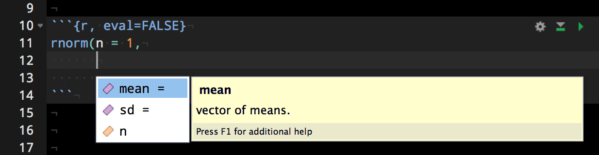

## Fuzzy Autocompletion

Rather than use prefix matching, RStudio performs 'fuzzy matching' when matching completion results to what you type.

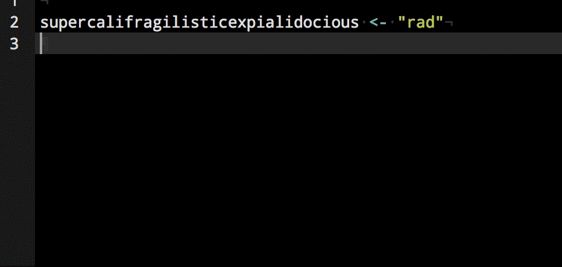

## Fuzzy Autocompletion

RStudio does substring-based matching on the text you type. The only requirement is that your input text occurs in the same order as in the item to be matched.

```{r}
## Let's see how exactly 'scflead' matches in
## The previous example. It's included as a
## completion candidate because it occurs
## 'in the same order' within the variable name.
##
##    supercalifragilisticexpialidocious
##    s____c___f____l_____e___a__d______
##
##
```

## Fuzzy Autocompletion

Naming conventions in R are often inconsistent -- some functions use `.` to separate words in a variable name, while others use `_` or otherwise. RStudio's autocompletion tries to be permissive about the presence or absence of these symbols.

```{r eval=FALSE}
package.ver
```

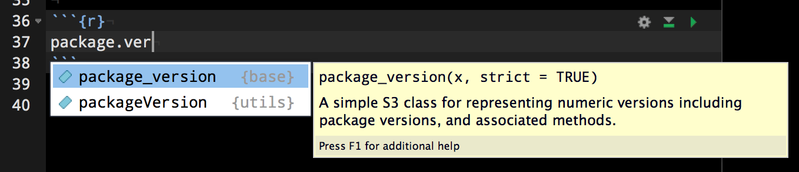

## Context-Specific Autocompletion

RStudio performs introspection on your document to identify completion items.

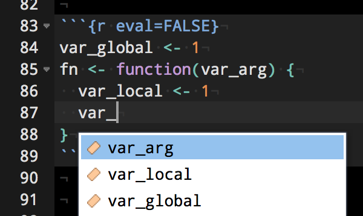

## Project-File Autocompletion

RStudio indexes all files in your project, and uses this to power the completion of file names within R strings.

For files within deeply nested directories, it will be sufficient to type only the first few letters of the file name; RStudio will fill in the other parts itself.

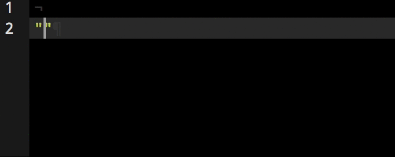

## Specialized Autocompletion

RStudio provides specialized autocompletion results in some contexts. For example, within `Sys.getenv()` and `Sys.setenv()`, we provide completions for all environment variables currently defined.

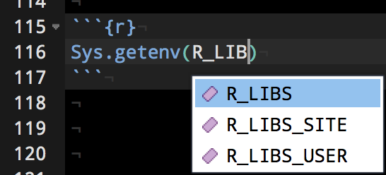

Similar behavior exists in `options()` / `getOption()`, and `attr()`.

## Markdown Path Completion

RStudio also provides autocompletion for paths used in Markdown-style links, for R Markdown documents. A similar discovery of paths within nested directories is performed here, as with completions for paths in strings.

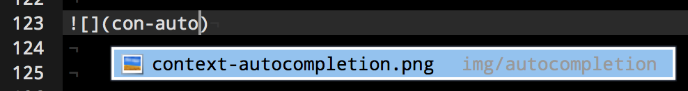

# Diagnostics

## R Code Diagnostics

You might've noticed that RStudio now highlights syntax errors (if any) in your code:


These particular diagnostics can be very helpful when building Shiny applications. However, RStudio comes with a set of richer diagnostics not enabled by default.

## R Code Diagnostics -- Enabling Extras

The following diagnostics can be enabled in the `Tools -> Global Options... -> Code` dialog.

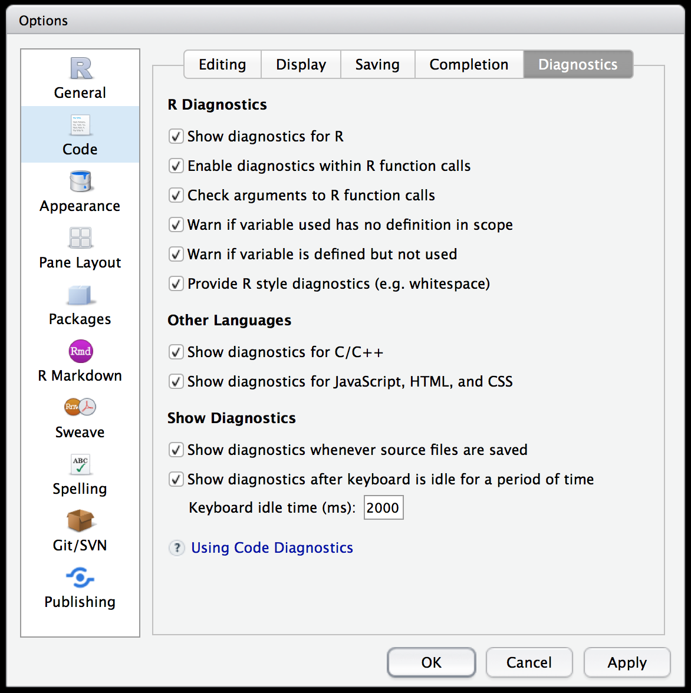

## Missing Arguments

RStudio will attempt to statically ascertain whether a function call might fail due to missing arguments. For example, in the following call to `rnorm()`, we have forgotten to pass the `n` argument.

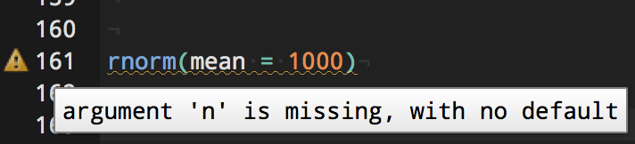

## No Definition in Scope

RStudio will detect the usage of variables that aren't actually available, or defined, in the current scope. This can be helpful for catching typos.

In the underlying code, we've defined a variable called `hw` but accidentally attempted to use it as `HW`.

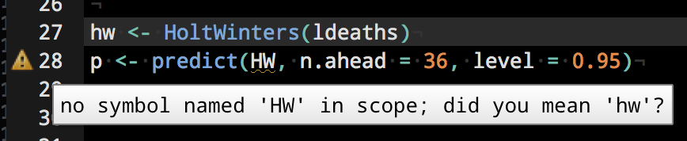

## Defined but not Used

In the following example, we attempt to compute `2 ^ n` by updating a value called `total` by multiplying it by 2 `n` times. However, we accidentally wrote `Total` within the body of the `for` loop. The diagnostics system detects this.

Note that the following code would run without error; however, it would produce the wrong result!

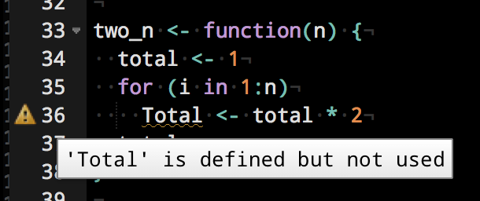

## Whitespace

RStudio will also provide so-called 'style' diagnostics, to help encourage the use of whitespace to make R code more readable.

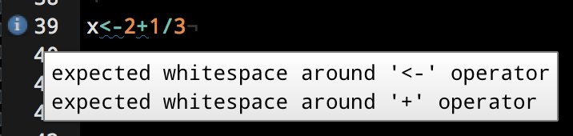

# Finding Things

## Fuzzy File Finder

One of the most useful, yet often least known about, commands in the RStudio IDE is `Go to file/function`. More affectionately, we call it the fuzzy file finder. This can be used to quickly navigate to any file, or function (R or C++), in your project.

The command can be invoked with `Ctrl + .`. Use it often!

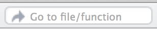

## Fuzzy File Finder

In the following example, we use the fuzzy file finder to locate the term `create` within the `devtools` package sources.

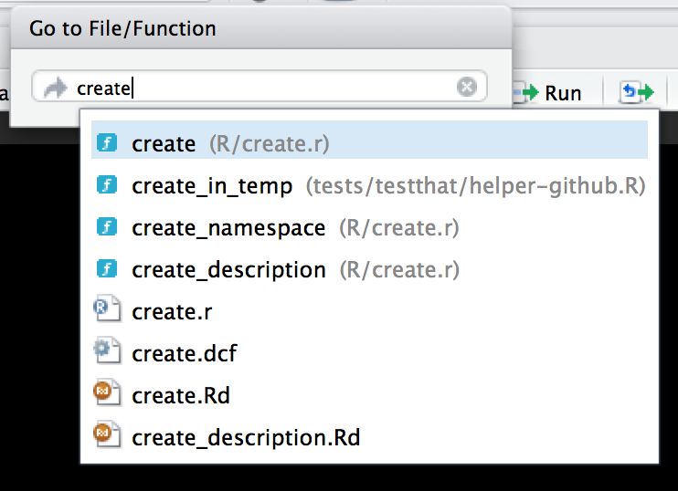

## Fuzzy File Finder

As per its name, the fuzzy file finder also does 'fuzzy' substring matching on the potential completion terms.

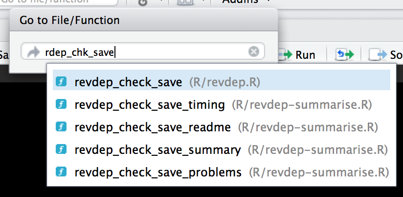

## Find in Files

Use `Ctrl + Shift + F` to search for terms in all files within some scope. The command can also be accessed from `Edit -> Find in Files...`.

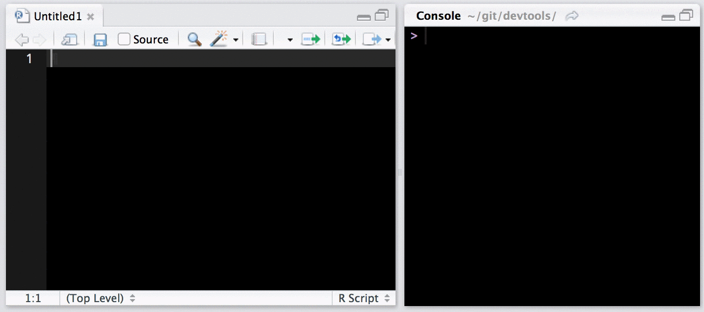

# Code Tools

## Execute a Statement at a Time

RStudio now executes a whole statement at a time with `Ctrl + Enter`, rather than a single line-wise execution.

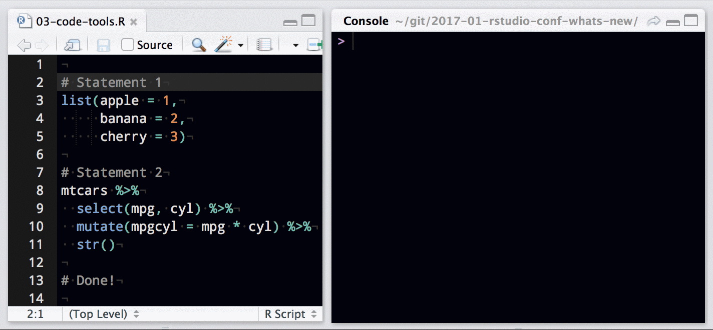

## Rename in Scope

Use `Ctrl + Alt + Shift + M` to rename the variable and all usages of that variable in the current scope.

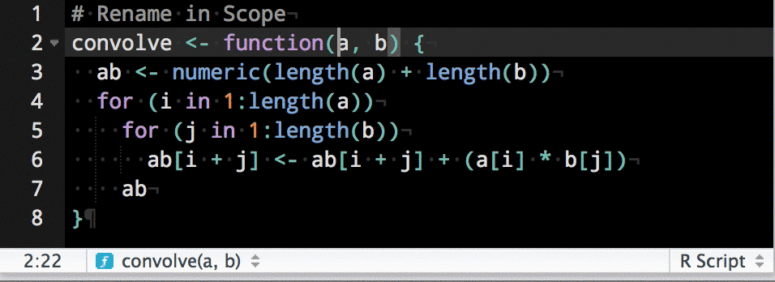

## Reformat Code

Use `Ctrl + Shift + A` to reformat the current selection. The code is reformatted and reindented to improve readability.

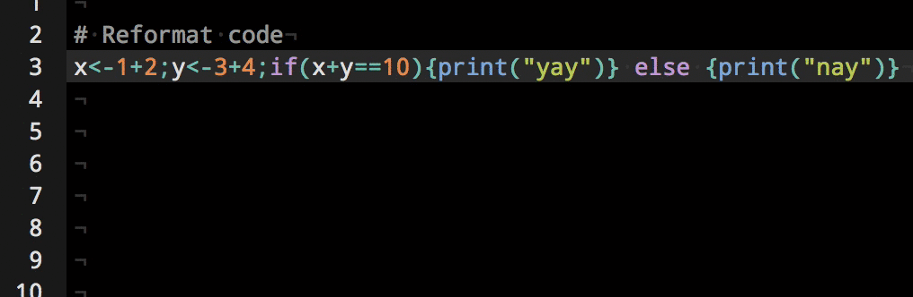

## Multiple Cursors

RStudio has support for multiple cursors (as seen before, using `Rename in Scope`). In the following demo, multiple cursors are generated by holding the `Alt` key, and clicking and dragging with the mouse.

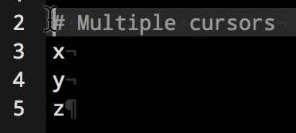

Multiple cursors can also be added using `Ctrl + Alt + Up/Down`; a new cursor is generated in the direction pressed.

## Insert Commonly Used Code

- Use `Alt + -` to insert the assignment operator. This will insert `<-` in R code, and `=` in other contexts.

- Use `Ctrl + Shift + M` to insert the [magrittr](https://cran.r-project.org/web/packages/magrittr/vignettes/magrittr.html) pipe operator.

- Use [RStudio Snippets](https://rstudio.github.io/rstudio-extensions/rstudio_snippets.html) to insert TextMate-like snippets of code. Use `<Shift + Tab>` to quickly insert a snippet. Use `<Tab>` to complete each section of the snippet.

- Use [RStudio Addins](https://rstudio.github.io/rstudio-extensions/rstudio_addins.html) to bind the execution of user-defined R code to RStudio menu items, or custom-defined keyboard shortcuts. Use the [`rstudioapi`](https://rstudio.github.io/rstudio-extensions/rstudioapi.html) package to write R code that interacts directly with the RStudio session.

# R Markdown

## Document Outline

Use `Ctrl + Shift + O` to toggle a document outline view in R Markdown (and other!) documents. This can be used to quickly navigate from section to section in source documents.

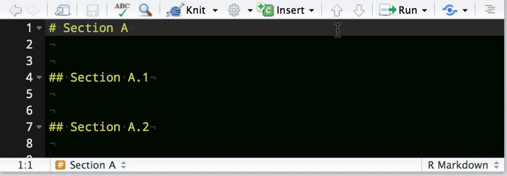

## LaTeX Chunks

RStudio will render latex contained within `$...$` and `$$...$$` blocks inline, letting you double-check your latex before rendering your final document.

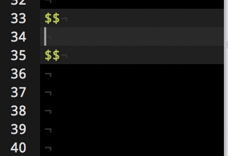

## Non-R Engines

Alternate engines (e.g. `python`) can be used as well.

```{python, eval=TRUE}
print [x ** 3 for x in range(1, 10)]
```

- Use `engine.path` to point to a particular executable for your engine.
- Use `engine.opts` to control what arguments are passed to the engine executable.

## Other Shortcuts to Know

> - `Ctrl + Alt + I` will insert an R chunk. (Never type ```` ``` ```` again!)
> - `Ctrl + Shift + Enter` will run a whole chunk at once.
> - `Ctrl + PageUp` and `Ctrl + PageDown` will navigate between chunks.

# Miscellaneous

## Editor Keybindings

Customize the editor keybindings -- both Vim and Emacs keybindings are available.

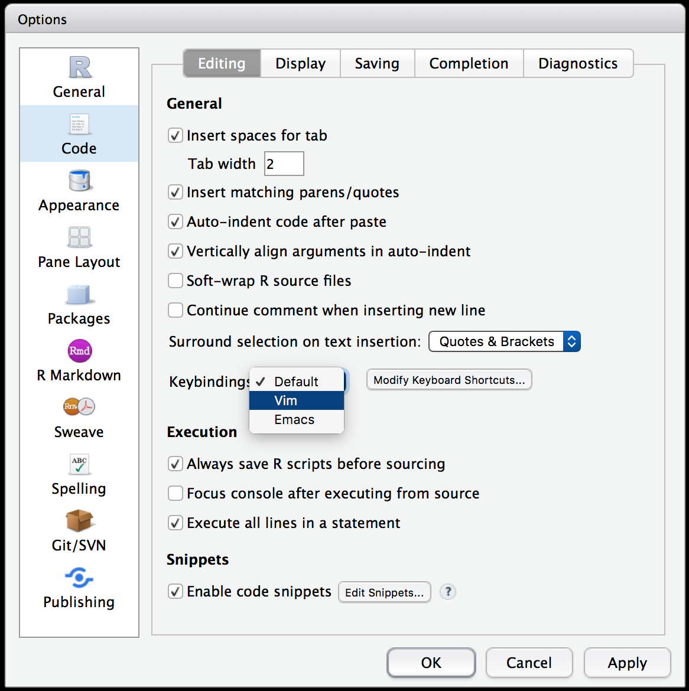

## Focus

Use `Ctrl + 1` and `Ctrl + 2` to quickly transfer focus between the source editor and the console.

Similarly, use `Ctrl + Shift + 1` to zoom the source pane, and `Ctrl + Shift + 2` to zoom the console.

Try different numbers to focus other panes in the IDE.

# Closing Up

## Keyboard Shortcuts

You can access a keyboard shortcut cheatsheet directly from the IDE. Use `Alt + Shift + K`, or click `Help -> Keyboard Shortcuts Help` from the main menu.


## Thanks for Attending!
