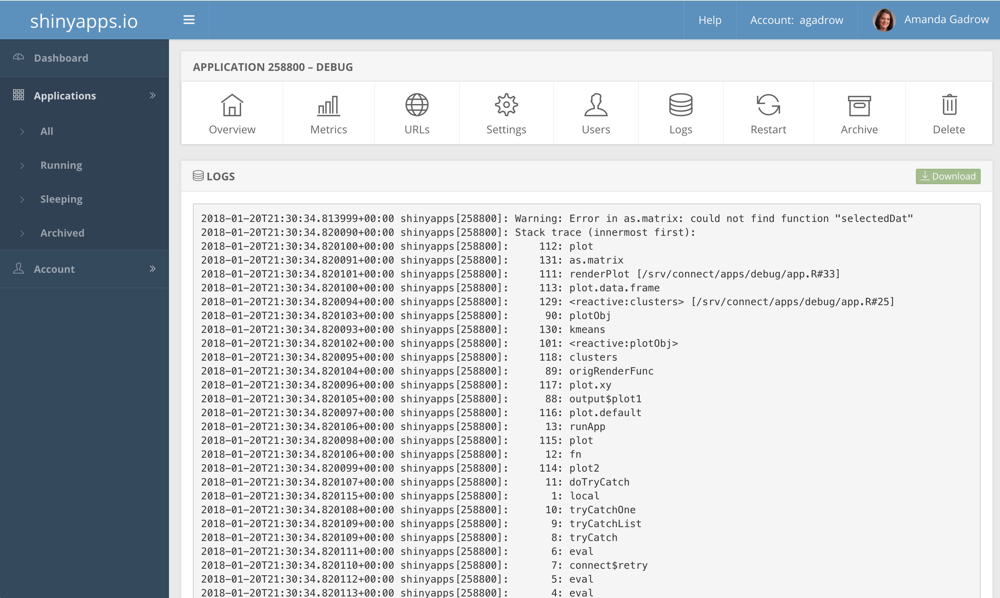
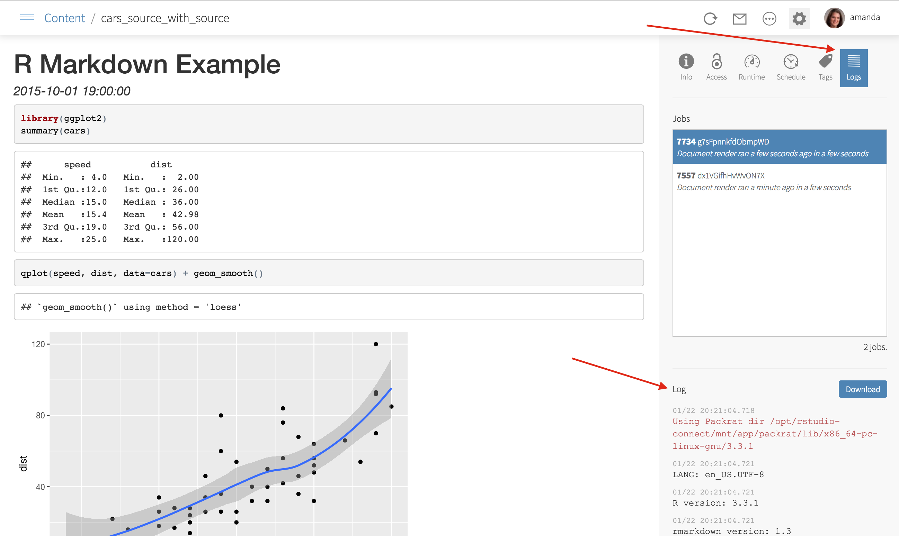

```{r setup, include=FALSE}
options(htmltools.dir.version = FALSE)
library(ggplot2)

thm <- theme_bw() + 
  theme(
    panel.background = element_rect(fill = "transparent", colour = NA), 
    plot.background = element_rect(fill = "transparent", colour = NA),
    legend.background = element_rect(fill = "transparent", colour = NA),
    legend.key = element_rect(fill = "transparent", colour = NA)
  )
theme_set(thm)
```

class: title-slide

# Debugging in RStudio
.pull-left[
Amanda Gadrow

February 2, 2018
]
.pull-right[]

---
class: rstudio-slide, left

# Debugging

Debugging is the process of stepping through your code to find the source of an unexpected problem.

---
class: rstudio-slide, left

# Shiny debugging
```
options(shiny.fullstacktrace = TRUE)
```

```
options(shiny.error = browser)
```

```
browser()
```

---
class: rstudio-slide, left

# Shiny tracing
```
runApp(appDir = "path/to/myApp", display.mode = "showcase")
```

```
options(shiny.reactlog = TRUE)
runApp(...)
showReactLog()
```

```
cat(file = stderr(), ...)
```

### shinyapps.io
```
rsconnect::showLogs(streaming = TRUE)
```

---
class: rstudio-slide, left

# Deployed app logs

.pull-left[]
.pull-right[]
