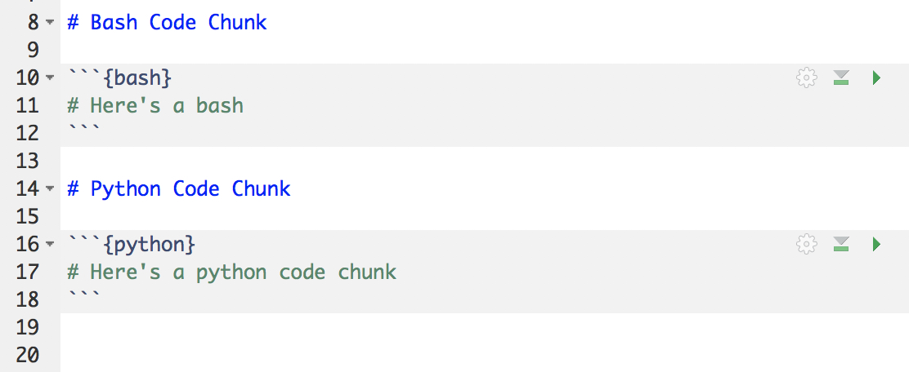

```{r setup, include=FALSE}
options(htmltools.dir.version = FALSE, servr.daemon = TRUE)
```
class: middle, inverse

# Multilingual RMarkdown



---
# Lots of Choices

```{r eval = FALSE}

# set engines for interpreted languages
local({
    for (i in c("awk", "bash", "coffee", "gawk", "groovy", 
        "haskell", "lein", "mysql", "node", "octave", 
        "perl", "psql", "Rscript", "ruby", "sas", "scala", 
        "sed", "sh", "stata", "zsh")) knit_engines$set(
          setNames(list(eng_interpreted), 
        i))
})

# additional engines
knit_engines$set(highlight = eng_highlight, Rcpp = eng_Rcpp, 
    tikz = eng_tikz, dot = eng_dot, c = eng_shlib, 
    fortran = eng_shlib, fortran95 = eng_shlib, asy = eng_dot, 
    cat = eng_cat, asis = eng_asis, stan = eng_stan, 
    block = eng_block, block2 = eng_block2, js = eng_js, 
    css = eng_css, sql = eng_sql, go = eng_go, python = eng_python, 
    julia = eng_julia)


```

.footnote[from Knitr's [code base](https://github.com/yihui/knitr/blob/1bdaf3965a516d5d3e1cd39440a1991492b17d84/R/engine.R#L620-L636)]

---
# Basic Language Engines

```{r eval = FALSE}

# set engines for interpreted languages
local({
    for (i in c("awk", "bash", "coffee", "gawk", "groovy", 
        "haskell", "lein", "mysql", "node", "octave", 
        "perl", "psql", "Rscript", "ruby", "sas", "scala", 
        "sed", "sh", "stata", "zsh")) knit_engines$set(
          setNames(list(eng_interpreted), 
        i))
})

```

.footnote[from Knitr's [code base](https://github.com/yihui/knitr/blob/1bdaf3965a516d5d3e1cd39440a1991492b17d84/R/engine.R#L620-L636)]


- Chunks execute independently

- Code, terminal output, and side effects affect output

- Chunk options similar to R chunks
---

# Special Language Engines

```{r eval = FALSE}

# additional engines
knit_engines$set(highlight = eng_highlight, Rcpp = eng_Rcpp, 
    tikz = eng_tikz, dot = eng_dot, c = eng_shlib, 
    fortran = eng_shlib, fortran95 = eng_shlib, asy = eng_dot, 
    cat = eng_cat, asis = eng_asis, stan = eng_stan, 
    block = eng_block, block2 = eng_block2, js = eng_js, 
    css = eng_css, sql = eng_sql, go = eng_go, python = eng_python, 
    julia = eng_julia)


```

.footnote[from Knitr's [code base](https://github.com/yihui/knitr/blob/1bdaf3965a516d5d3e1cd39440a1991492b17d84/R/engine.R#L620-L636)]


- code may be available throughout the document

- objects may be available to R

- special visualizations

---
class: middle, center, inverse

# flexible; central; collaborative
