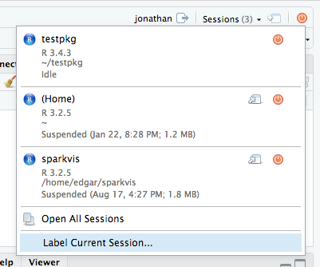
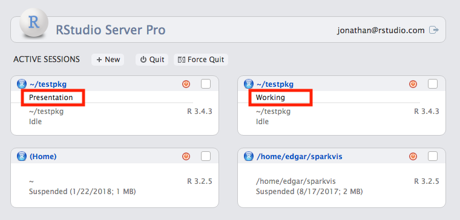
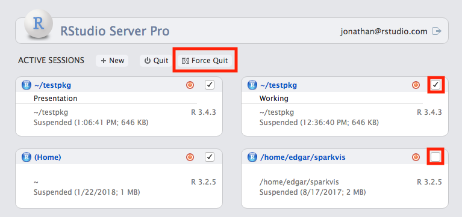
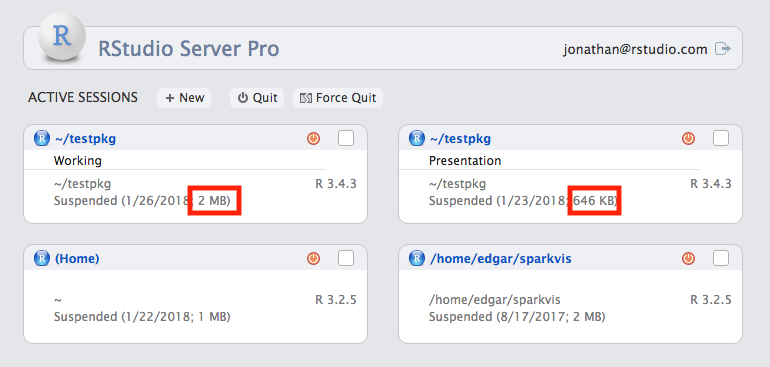
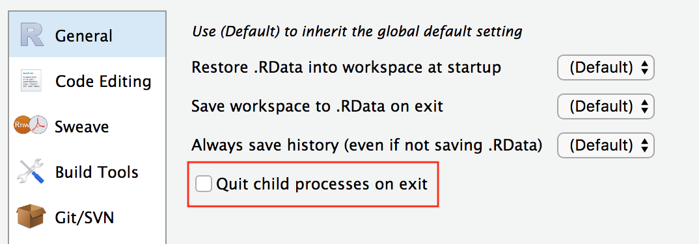
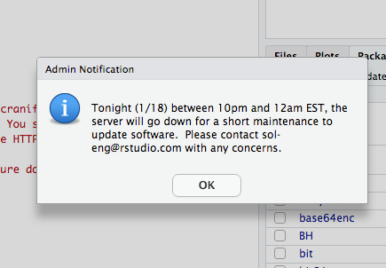
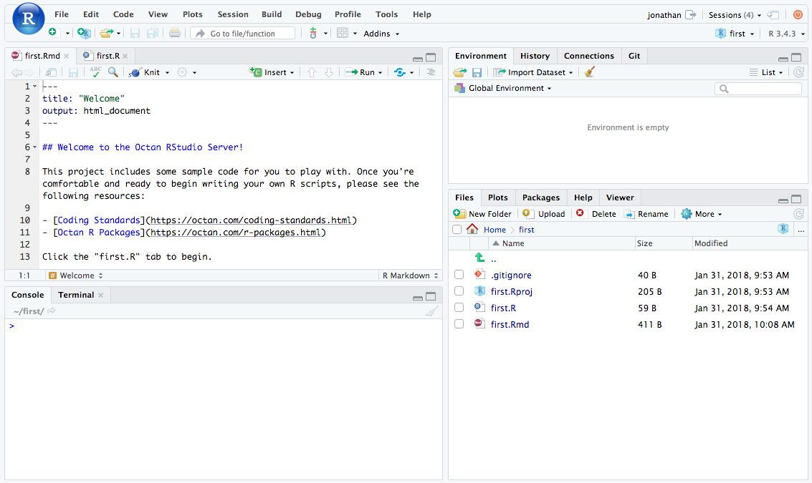

```{r setup, echo=FALSE}
library(DiagrammeR)
```

# Agenda

## For Users

- Session Management
- Session Cleanup

## For Admins

- Notifications
- Session Cleanup
- Licensing in Docker/VMs
- First Project Template

# Users

## Label Sessions



## Label Sessions



## Cleanup Sessions



## Session Info



## Session child management



## Summary

- Label sessions for easy access
- Select multiple sessions for cleanup
- Force-quit sessions when necessary
- Session size info for estimating resume time

# Admins

## Session Multiplication

- Home directory space is often constrained
- Users don't take time to clean up sessions
- Sessions can be very large

## Session Cleanup

- Fully clean up unused sessions
- Recover disk space

## Session Cleanup

    session-timeout-kill-hours=168

## Session Cleanup Caveats

- Unused sessions means "user interaction"
- Force-kill is used; set timeout accordingly
- Users can lose unsaved data

## Notifications

*How do you communicate impending maintenance or other downtime?*

## Notifications



## Notifications

- Set message start time/end time
- Notification will be delivered to each user session
- Scriptable

## Notifications

    /etc/rstudio/notifications.conf
    
    StartTime: 2018-06-01 10:33:00 -05:00
    EndTime: 2018-06-05
    Message: The server will go down tonight from 10pm to 12am
        for maintenance.

## Licensing in Containers/VMs

- RSP License bound to physical hardware
- Must deactivate and re-activate when moving hardware

## Activating in Containers

```{r, echo=FALSE, fig.width=10, fig.height=6}
grViz(diagram = "gv/turboactivate.gv")
```

## Container/VM Activation Challenges

- License tied to hardware
- Internet access required inside containers
- Keys required inside containers
- License lost if container deleted w/o deactivate

## Floating Licensing {class="center"}

```{r, echo=FALSE, fig.width=10, fig.height=6}
grViz(diagram = "gv/turbofloat.gv")
```

## Floating Licensing

- License concurrent instances, not hardware
- No license needed in containers (just address of server)
- No internet access needed in containers
- OK if container destroyed/deleted unexpectantly
- Available in other RStudio products, too

## First Project Template

- Help new users
- Provide a template for common tasks
- Supply examples of correct code and style

## First Project Template

    session-first-project-template-path=/etc/rstudio/welcome-project

## First Project Template



## First Project Template

- Copied to home directory on first login
- Opened in first user session
- Can control which files are opened in tabs

## Professional drivers

- High-performance ODBC drivers
- Many enterprise and cloud data sources available
- Connect with RSP and other RStudio products

## Summary

- Clean up resources from old sessions
- Give users timly notifications
- License with confidence in containers and VMs
- Get new users started on the right foot
- Use professional data drivers

## Further Reading

docs.rstudio.com/ide/server-pro

# Q & A
