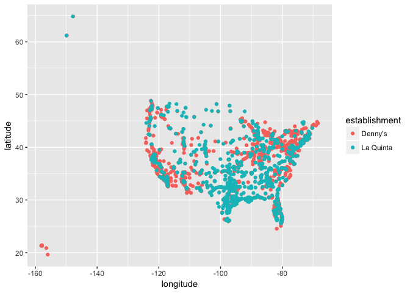

Lab 03 - Visualizing spatial data
================
TEAM NAME
DATE

### Load packages

``` r
library(tidyverse) 
```

### Load data

``` r
dn <- read_csv("data/dennys.csv")
lq <- read_csv("data/laquinta.csv")
states <- read_csv("data/states.csv")
```

### Exercise 1

prose goes here...

``` r
#code goes here
```

### Exercise 2

...

### Exercise 10

``` r
# data prep
dn <- dn %>%
  mutate(
    establishment = "Denny's",
    country = "United States"
  ) %>%
  filter(country == "United States")

lq <- lq %>%
  mutate(
    establishment = "La Quinta",
    country = case_when(
      state %in% state.abb     ~ "United States",
      state %in% c("ON", "BC") ~ "Canada",
      state == "ANT"           ~ "Columbia",
      state == "FM"            ~ "Honduras",
      TRUE                     ~ "Mexico")) %>%
  filter(country == "United States")

dn_lq <- bind_rows(dn, lq)    

# plot
ggplot(dn_lq, mapping = aes(x = longitude, y = latitude, color = establishment)) +
  geom_point()
```


