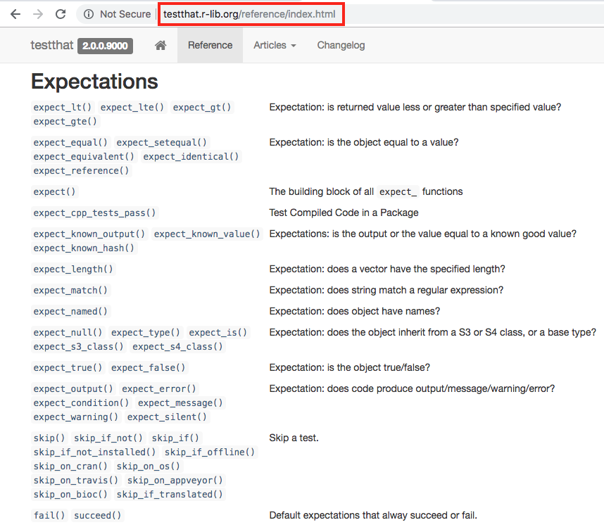
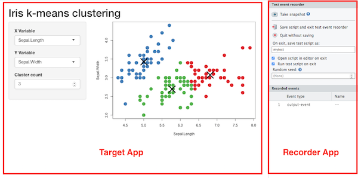
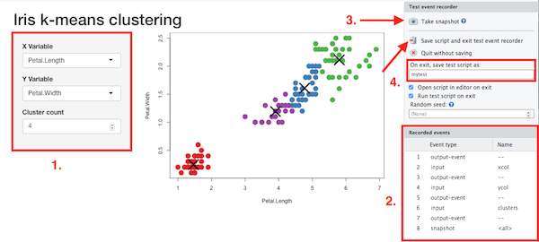
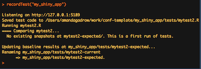
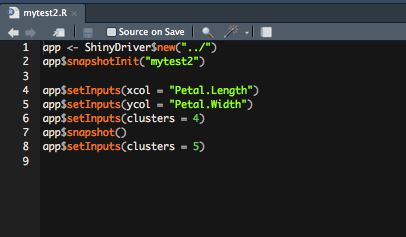
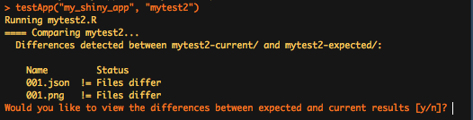
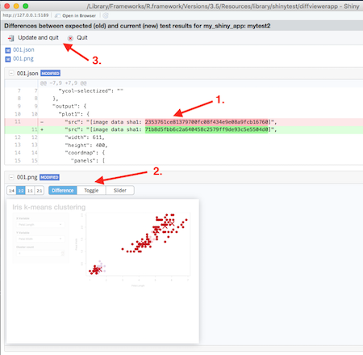

```{r setup, include=FALSE}
options(htmltools.dir.version = FALSE)
library(ggplot2)

thm <- theme_bw() + 
  theme(
    panel.background = element_rect(fill = "transparent", colour = NA), 
    plot.background = element_rect(fill = "transparent", colour = NA),
    legend.background = element_rect(fill = "transparent", colour = NA),
    legend.key = element_rect(fill = "transparent", colour = NA)
  )
theme_set(thm)
```

class: panel-narrow-slide, left

# Data science through code

Purpose of the code:

- To answer a question, or make a prediction

- To make it easier to reproduce and improve analyses

- To collaborate with others on shared projects

- To distribute findings easily

- To distribute useful functions internally or with the community

---

class: panel-narrow-slide, left

# Data science through code

Code is written in the service of analysis

It is a means to an end, but it is also an artifact

---

class: panel-narrow-slide, left

# Data science through code

Characteristics of good code:

- Reliability

- Reproducibility

- Flexibility

- Longevity

- Scalability

---

class: panel-narrow-slide, left

# Code quality matters

How do we determine the quality of our code?

--

- Execution feedback

- User feedback

--

- Measure it with **tests**: functional, integration, performance

---

class: panel-narrow-slide, left

# Code quality matters

Measure it with **tests**: functional, integration, performance

Make this part of your regular development cycle for: 

--

  - Faster updates

  - Quick feedback on impact of changes

  - Visibility into internal dependencies

  - Easily trace the function, scope, and meaning of code

---

class: panel-narrow-slide, left

# Writing tests

- **Ideally**, cover all code paths

- **Practically**, start with the major functions, inputs, and integration points

--

- Run manual tests in the console during development

- Convert them to coded tests when the basic functionality is established

--

An ounce of prevention is worth a pound of cure.

---

class: panel-narrow-slide, left

# `testthat`

```{r eval=FALSE}
# Install the released version from CRAN
install.packages("testthat")

# Set up test infrastructure:
# Create ‘tests/testthat.R’ and ‘tests/testthat/’, and adding testthat to the suggested packages in the package DESCRIPTION
# install.packages("usethis")
usethis::use_testthat()

# Create a new test file
# Create ‘tests/testthat/test-<name>.R’ and open it for editing
usethis::use_test("name")

```

---

class: panel-narrow-slide, left

An example of a test file from the stringr package:

```
context("String length")
library(stringr)

test_that("str_length is number of characters", {
  expect_equal(str_length("a"), 1)
  expect_equal(str_length("ab"), 2)
  expect_equal(str_length("abc"), 3)
})

test_that("str_length of factor is length of level", {
  expect_equal(str_length(factor("a")), 1)
  expect_equal(str_length(factor("ab")), 2)
  expect_equal(str_length(factor("abc")), 3)
})

test_that("str_length of missing is missing", {
  expect_equal(str_length(NA), NA_integer_)
  expect_equal(str_length(c(NA, 1)), c(NA, 1))
  expect_equal(str_length("NA"), 2)
})
```
---

class: panel-narrow-slide, left

An example of a test file from the stringr package:

```
context("String length")                            <- context describes the set of tests
library(stringr)

test_that("str_length is number of characters", {   <- tests exercise the output of
  expect_equal(str_length("a"), 1)                      a single function with 1+ expectation
  expect_equal(str_length("ab"), 2)
  expect_equal(str_length("abc"), 3)                <- expectations describe the
})                                                      expected result of a computation

test_that("str_length of factor is length of level", {
  expect_equal(str_length(factor("a")), 1)
  expect_equal(str_length(factor("ab")), 2)
  expect_equal(str_length(factor("abc")), 3)
})

test_that("str_length of missing is missing", {
  expect_equal(str_length(NA), NA_integer_)
  expect_equal(str_length(c(NA, 1)), c(NA, 1))
  expect_equal(str_length("NA"), 2)
})
```
---

class: panel-narrow-slide, left

# Expectations

``` {r echo=FALSE, out.width=700, out.height=617}

```

---

class: panel-narrow-slide, left

# Development workflow

Once you’re set up, the workflow is simple:

1. Modify your code or tests.

2. Test your package with Ctrl/Cmd + Shift + T in RStudio, or `devtools::test()` in the console.

3. Repeat until all tests pass.

---

class: panel-narrow-slide, left

# Testing considerations

User experience

- Expected results for each function
- Common mistakes or typos

.pull-left[
Test coverage

- External interfaces
- Fragile code
- Input types
]
.pull-right[
Test design

- One test per behavior
- One test per bug
]

--

.center[**hard to test == hard to maintain**]

---

class: panel-narrow-slide, left

# `shinytest`

```{r eval=FALSE}
# install.packages("devtools")
library(devtools)
install_github("rstudio/shinytest")
# shinytest::installDependencies()
library(shinytest)

# Record test
recordTest("path/to/app")

# Run test
testApp("path/to/app")           # all tests
testApp("path/to/app", "mytest") # individual test
```

---

class: panel-narrow-slide, left

# `shinytest`

`shinytest::recordTest("my_shiny_app")`

``` {r echo=FALSE}

```

---

class: panel-narrow-slide, left

# `shinytest`

`shinytest::recordTest("my_shiny_app")`

``` {r echo=FALSE}

```

---
class: panel-narrow-slide, left

# `shinytest`

`shinytest::recordTest("my_shiny_app")`

``` {r echo=FALSE}


```

---

class: panel-narrow-slide, left

# `shinytest`

`shinytest::testApp("my_shiny_app", "test_name")`

``` {r echo=FALSE}

```

---

class: panel-narrow-slide, left

# `shinytest`

`shinytest::testApp("my_shiny_app", "test_name")`

``` {r echo=FALSE}

```

---

class: panel-narrow-slide, left

# Designing for ease of testing

Good software practices

- Goals
  - Reliability, Reproducibility, Flexibility, Longevity, Scalability
  - Good user experience
  - High degree of confidence
  - Modular design for ease of testing and maintenance

---

class: panel-narrow-slide, left

# Designing for ease of testing

Good software practices

- Goals
  - Reliability, Reproducibility, Flexibility, Longevity, Scalability
  - Good user experience
  - High degree of confidence
  - Modular design for ease of testing and maintenance
- Modular design
  - Decoupling, code isolation
  - DRY: Don't Repeat Yourself
  - KISS: Keep It Simple, Stupid
  - Consistent code style

---

class: panel-narrow-slide, left

# Designing for ease of testing

Good software practices

- Goals
  - Reliability, Reproducibility, Flexibility, Longevity, Scalability
  - Good user experience
  - High degree of confidence
  - Modular design for ease of testing and maintenance
- Modular design
  - Decoupling, code isolation
  - DRY: Don't Repeat Yourself
  - KISS: Keep It Simple, Stupid
  - Consistent code style
- User experience (including Future You)
  - Ease of use
  - Error handling

---

class: panel-narrow-slide, left

# Profit!

But remember:

The tests won't **ensure** high quality in your script or application; they just **verify** it when it's there.

---

class: panel-narrow-slide, left

# Resources to read/watch:

- [*R packages*](http://r-pkgs.had.co.nz/package.html) by Hadley Wickham, particularly the chapter on [Testing](http://r-pkgs.had.co.nz/tests.html)
- [*Advanced R*](http://adv-r.had.co.nz/) by Hadley Wickham, for advice on good software design
- [Jenny Bryan's video](https://www.youtube.com/watch?v=7oyiPBjLAWY) on ["Code smells and feels"](https://rstd.io/code-smells) from useR!2018
- Charles Gray's [blog post](http://cantabile.rbind.io/posts/2019-01-05-its-not-not-the-math-its-the-code/)  on the benefits of a workflow based on `testthat::auto_test`
- Winston Chang's [talk on testing shiny apps](https://www.rstudio.com/resources/videos/developing-robust-shiny-apps-with-regression-testing/) with `shinytest` from rstudio::conf(2018)

---

class: panel-narrow-slide, left

# Resources for testing packages:

.pull-left[
Unit Tests
- [testthat](https://testthat.r-lib.org/)
  - [usethis](https://usethis.r-lib.org/)
  - [devtools](https://cran.rstudio.com/web/packages/devtools/index.html)
- [testit](https://github.com/yihui/testit)
- [testthis](https://cran.rstudio.com/web/packages/testthis/index.html)
- [assertive](https://bitbucket.org/richierocks/assertive)
- [RUnit](https://cran.rstudio.com/web/packages/RUnit/index.html)

Shiny Tests
- [shinytest](https://rstudio.github.io/shinytest/articles/shinytest.html)
]
.pull-right[
Performance Tests
- [profvis](https://rstudio.github.io/profvis/) (see also the ["Performance" chapter in *Advanced R*](http://adv-r.had.co.nz/Performance.html))
- [shinyloadtest and shinycannon](https://rstudio.github.io/shinyloadtest/)

Code Coverage
- [covr](https://cran.rstudio.com/web/packages/covr/index.html) and [covrpage](https://github.com/metrumresearchgroup/covrpage)
]

---

class: panel-narrow-slide, left

# Next steps

- Start small, and give it a go
- Look for opportunities to improve the functional code to be more testable, and therefore, more maintainable
- Make a habit of running all the tests locally before checking in code
  - If you're not already using source control, see Jenny Bryan's [Happy Git and GitHub for the useR](https://happygitwithr.com/)
- Add more tests over time
- Integrate tests into Continuous Integration (CI) pipeline, if applicable
- Bask in the warm glow of reliability, maintainability, and transparency

---

class: blank-slide, blue, center, middle

# Thank you

Amanda Gadrow

amanda@rstudio.com


Slides and code examples will be available after the conference.
