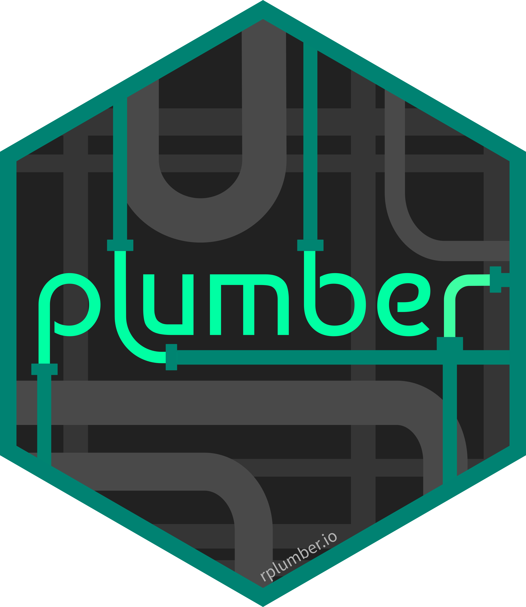
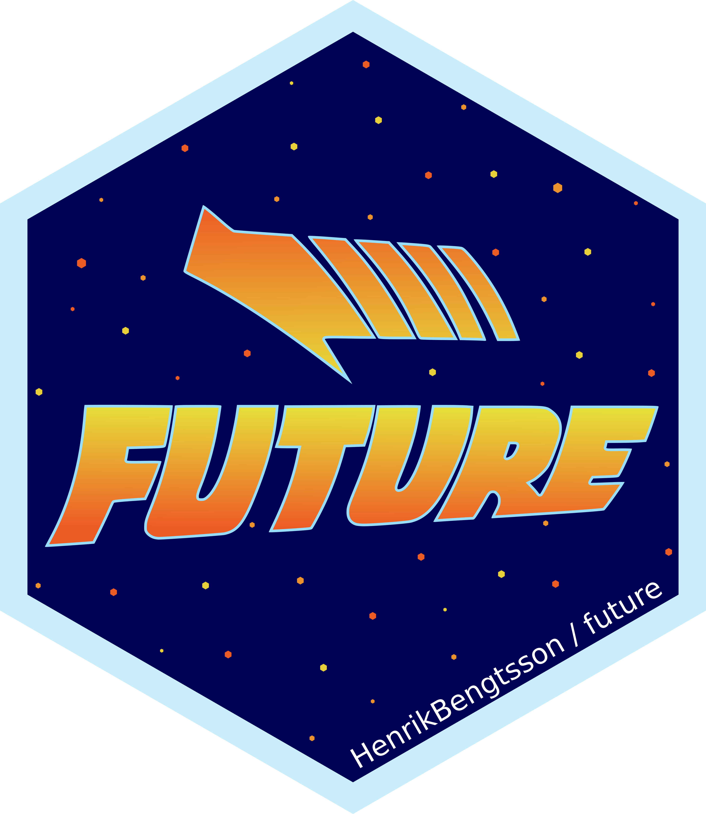

# Slides and resources for "`plumber` + `future`: Async Web APIs"

<table style="margin:0px">
  <tr>
    <td></td>
    <td vlign="center">+</td>
    <td></td>
  </tr>
</table>

## Slides

* HTML: http://schloerke.com/presentation-2021-01-rstudio-global-plumber-async

* PDF: http://schloerke.com/presentation-2021-01-rstudio-global-plumber-async/plumber_future.pdf

## Resources for learning more

* [`plumber` webpage](https://www.rplumber.io/)
  * An API Generator for R

* [`future` webpage](https://github.com/HenrikBengtsson/future)
  * Unified Parallel and Distributed Processing in R for Everyone

* [`promises` webpage](https://rstudio.github.io/promises/)
  * Abstractions for Promise-Based Asynchronous Programming
