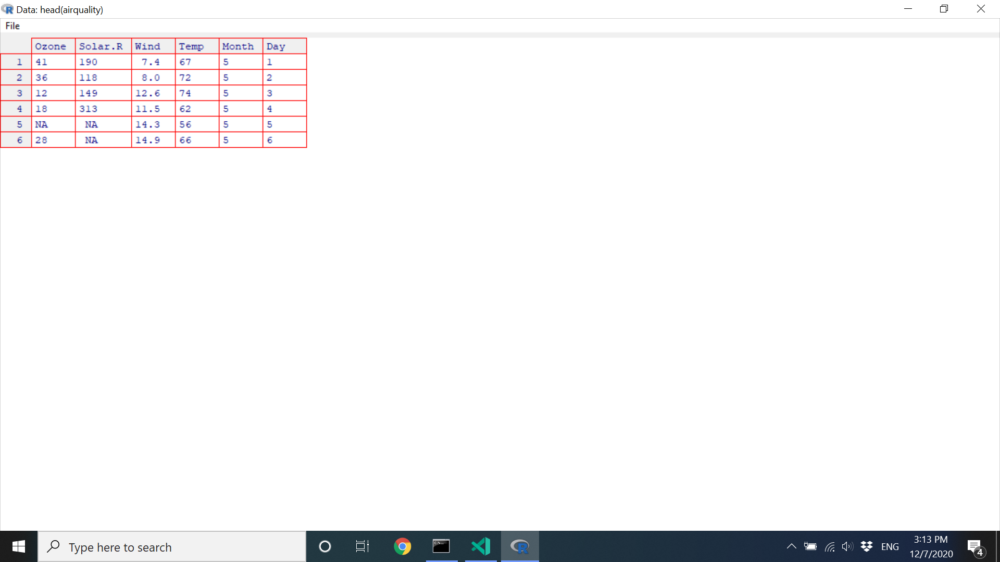

```{r setup, include=FALSE}
options(htmltools.dir.version = FALSE)
# Set knitr global options:
library(knitr)

knitr::opts_chunk$set(tidy = "styler", cache = TRUE, cache.comments = FALSE, autodep = TRUE, echo = TRUE, message = FALSE, warning = FALSE, fig.path = "fig/")
dep_auto()

# Seed for random number generation
set.seed(7777)

# For citation:
library(RefManageR)
BibOptions(check.entries = FALSE,
           bib.style = "authoryear",
           cite.style = "authoryear",
           style = "markdown",
           hyperlink = FALSE,
           dashed = FALSE)
bib <- ReadBib("references.bib", check = FALSE)
```


class: center, middle, inverse

# How Do I Use Computer?
???
Start with a basic question.
---
class: center, middle

# Interaction with Computer

.pull-left-50[
.content-box-green[.large[.large[## Input
]]

]]

.pull-right-50[
.content-box-red[.large[.large[## Output]]

]]
???
Put it another way. How do I interact with computer input and output?
---
class: center, middle

# Non-Visual Interaction

.pull-left-50[
.content-box-green[.large[.large[## Input
]]

]]

???
Non-visual interaction
--

.pull-right-50[.content-box-red[.large[.large[
## Output
]]

]]
???
Non-visual interaction: keyboard only and speaker instead of computer screen.---
---
background-image: url(https://d33wubrfki0l68.cloudfront.net/571b056757d68e6df81a3e3853f54d3c76ad6efc/32d37/diagrams/data-science.png)
background-size: contain

???
Import, Tidy, Transform, Visualize, and Model
---
class: center, middle, inverse

# Why R?

## CLI == fully accessible via keyboard.

## Rmd -> reproducibility -> accessibility.

## Accessible open-source packages.

???
Why R?

As opposed to point-and-click UI, R is a command-line env.

This means that you can everything within terminal console using keyboard only.

Good benefit for keyboard users.

Rmd is a plain text. can be written with any text editor.
---
# What about IDE Accessibility?

.pull-left-50[.large[.large[
## RStudio IDE


* Desktop >= v1.3
* Server >= v1.3 (recommendable)
]]]

.pull-right-50[.large[.large[
## VSCode


### Extensions

* R
* R Debugger
* R LSP Client
]]]
???
Why not using IDE?
---
class: center, middle

# [Using RStudio Server in Windows WSL2](https://support.rstudio.com/hc/en-us/articles/360049776974-Using-RStudio-Server-in-Windows-WSL2)

???
Use WSL2
---
background-image: url(https://d33wubrfki0l68.cloudfront.net/246f0b63660ced61cdb88fae68a6d323ffc464cc/dd74c/2020/03/04/rstudio-1-3-preview-accessibility/accessibility-options.png)
background-size: contain

.footnote[Contact at [`accessibility@rstudio.com`](mailto:accessibility@rstudio.com)]

???
RStudio accessibility option.
---
background-image: url(https://blog.rstudio.com/2020/03/04/rstudio-1-3-preview-accessibility/focus-indicator-loop.gif)
background-size: contain

.footnote[Contact at [`accessibility@rstudio.com`](mailto:accessibility@rstudio.com)]

???
tab key moving focus
---
# Accessible Packages

* [{gt}](https://github.com/rstudio/gt): data.frame and tibble.
* [{sonify}](https://cran.r-project.org/web/packages/sonify/): scatter plot and line chart.
* [{BrailleR}](https://github.com/ajrgodfrey/BrailleR): histogram, barplot, and boxplot.
* [{shiny}](https://github.com/rstudio/shiny): interactive navigation.
* [{rmarkdown}](https://github.com/rstudio/rmarkdown): Swiss army knife for accessibility.
???
Accessible packages
---
class: center, middle, inverse

# Interaction with Data Frame

???
Interaction with Data Frame
---
# Problem?

.pull-left-50[
```{r}
utils::View(head(airquality))
```
]

.pull-right-50[

]


???
utils::View() is not accessible
---
# {gt}<sup>*</sup>

```{r}
# In place of `View()`:
gt::gt(head(airquality))
```

.footnote[[*]: `r Citet(bib, "R-gt", .opts = list(cite.style = "authoryear"))`.]
???
gt for data.frame
---
class: center, middle, inverse

# Interaction with Scatter Plot

???
Interaction with Scatter Plot
---
# {sonify}<sup>*</sup>

.pull-left-50[
```{r}
plot(x = 1:5, y = 1:5)
```
]

--

.pull-right-50[
```{r, eval = FALSE}
sonify::sonify(x = 1:5, y = 1:5)
```
]

.footnote[[*]: `r Citet(bib, "R-sonify", .opts = list(cite.style = "authoryear"))`.]
???
sonification
---
class: center, middle, inverse

# Interaction with Histogram

<audio autoplay>
<source src="sonify.wav" type="audio/wav"/>
</audio>

???
Interaction with Histogram
---
class: center, middle

# Visual Histogram

```{r}
hist(airquality$Ozone, col = "lightgreen")
```
???
Visual Histogram
---
# {BrailleR}<sup>*</sup>

```{r include = FALSE}
alt <- capture.output(BrailleR::VI(hist(airquality$Ozone)))
```

```r
BrailleR::VI(hist(airquality$Ozone))
```

```{r, echo = FALSE, style = TRUE}
alt
```

.footnote[[*]: `r Citet(bib, "R-BrailleR", .opts = list(cite.style = "authoryear"))`.]

???
BrailleR package for histogram
---
class: center, middle, inverse

# Interaction with Boxplot

???
Interaction with Boxplot
---
class: center, middle

# Visual Boxplot

```{r}
boxplot(count ~ spray, data = InsectSprays, col = "lightgray")
```
???
Visual Boxplot
---
# {BrailleR}

```{r include = FALSE}
alt <- capture.output(BrailleR::VI(boxplot(count ~ spray, data = InsectSprays, col = "lightgray")))
```

```r
BrailleR::VI(boxplot(count ~ spray, data = InsectSprays, col = "lightgray"))
```

```{r, echo = FALSE, style = TRUE}
alt
```

???
BrailleR package for Boxplot
---
class: center, middle, inverse

# Math
???
Math
---
# {rmarkdown}

```yaml
---
output: html_document
---
```
```markdown
$$\begin{array}{ccc}
x_{11} & x_{12} & x_{13}\\
x_{21} & x_{22} & x_{23}
\end{array}$$
```
???
Math content using Rmd
---
# {rmarkdown}<sup>*</sup>

$$\begin{array}{ccc}
x_{11} & x_{12} & x_{13}\\
x_{21} & x_{22} & x_{23}
\end{array}$$

.footnote[[*]: `r Citet(bib, "R-rmarkdown", .opts = list(cite.style = "authoryear"))`.]
???
result
---
class: center, middle, inverse

# {shiny}

???
shiny
---
# {shiny}<sup>*</sup>

## Accessibility Improvements

```r
# Version > 1.5
remotes::install_github("rstudio/shiny")
```

.footnote[[*]: `r Citet(bib, "R-shiny", .opts = list(cite.style = "authoryear"))`.]

???
internship super excited to tell you
---
# {shiny}

## Bootstrap Accessibility

* Added [bootstrap accessibility plugin](https://github.com/paypal/bootstrap-accessibility-plugin).

* Enhancements: alert, tooltip, popover, modal dialog, dropdown, tab Panel, collapse, and carousel elements.
???
Bootstrap a11y
---
# {shiny}

## Widget Accessibility

???
Widget a11y
--

`selectInput()`

???
`selectInput()`
--

`fileInput()`

???
`fileInput()`
--

`icon()`

???
`icon()`
--

`radioButtons()`

???
`radioButtons()`
--

`checkboxGroupInput()`

???
`checkboxGroupInput()`
--

`dateInput()`

???
`dateInput()`
--

`dateRangeInput()`

???
`dateRangeInput()`
--

`*Output()` and `update*Input()`
???
`*Output()` and `update*Input()`
---
# {shiny}

## Semantics Accessibility

???
Semantics Accessibility
--

### Alt Text

* `renderPlot(..., alt = "Plot object")`

???
static alt text
--

* `renderPlot(..., alt = reactive({ ... }))`

???
Dynamic alt text
--

### Shiny App Language

* `fluidPage(..., lang = "en")`

???
ISO 639-1 language code
--

### Landmarks

* "main" role for `mainPanel()`; "complementary" for `sidebarPanel()`

???
Landmarks

"main" role for `mainPanel()`; "complementary" for `sidebarPanel()`
---
class: middle, center, inverse

# Data Science Requires *Insight* (NOT Sight)

???
Data Science Requires Insight (NOT Sight)
---
class: center, middle, inverse

# Thank You!

???
Thank you
---
# Contact

## `r fontawesome::fa("twitter")`: [`@seo_jooyoung`](https://twitter.com/seo_jooyoung)

## `r fontawesome::fa("github")`: [`@jooyoungseo`](https://github.com/jooyoungseo)

## `r fontawesome::fa("blog")`: [jooyoungseo.com](https://jooyoungseo.com)

???
Contact info
