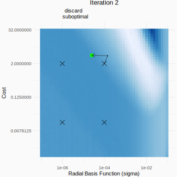

```{r knitr, include = FALSE}
library(tidymodels)
library(lme4)
library(finetune)
library(doMC)              # <- only if you are on linux or macOS
registerDoMC(cores = 10)   # <- only if you are on linux or macOS
library(icon) # https://github.com/ropenscilabs/icon

knitr::opts_chunk$set(fig.path = "images/")

thm <- theme_bw() + 
  theme(
    panel.background = element_rect(fill = "transparent", colour = NA), 
    plot.background = element_rect(fill = "transparent", colour = NA),
    legend.position = "top",
    legend.background = element_rect(fill = "transparent", colour = NA),
    legend.key = element_rect(fill = "transparent", colour = NA)
  )
theme_set(thm)

# ------------------------------------------------------------------------------

data(cells)
cells <- cells %>% select(-case)
set.seed(33)
cell_folds <- vfold_cv(cells)
roc_res <- metric_set(roc_auc)

svm_rec <- 
  recipe(class ~ ., data = cells) %>%
  step_YeoJohnson(all_predictors()) %>%
  step_normalize(all_predictors())

svm_spec <- 
 svm_rbf(cost = tune(), rbf_sigma = tune()) %>% 
 set_engine("kernlab") %>% 
 set_mode("classification")

svm_wflow <- 
  workflow() %>% 
  add_model(svm_spec) %>% 
  add_recipe(svm_rec)

svm_param <- 
 svm_wflow %>% 
 parameters() %>% 
  update(rbf_sigma = rbf_sigma(c(-7, -1)))
```


# tidymodels and Me

.pull-left[

I'm a statistician and software Engineer for RStudio working on modeling. 

Formerly 6y in infectious disease diagnostics and 12y in drug discovery. 

`max@rstudio.com`, `r icon::fa("github")` topepo, `r icon::fa("twitter")` topepos 

`r icon::fa("link")` [`https://rstd.io/global2021/maxkuhn`](https://rstd.io/global2021/maxkuhn) 

]
.pull-right[

tidymodels is a collection of modeling packages designed with the same principles as the tidyverse. 

]


<br> 

```{r tm-pic, echo = FALSE, out.width="100%", fig.align="center"}
knitr::include_graphics("images/tidymodels_wall_really_long.png")
```

---

# Recent Updates


.pull-left[

Interfaces:

* `workflows` have a new interface for adding raw data columns (e.g. no formula or recipe)

* `recipes` now support all of the new `tidyselect` selectors

* `recipes` can now use `bake()` instead of `juice()` for the training set. 

* The `autoplot()` method for `tune` objects works better for regular grids. 

]
.pull-right[


Efficiency: 

* Parallel processing via PSOCK clusters on windows is less awful. 

* `tune` can now use a larger number of parallel workers when tuning. 

* For the 3 models that use them, sparse matrices can be passed from recipes to model functions. 


]

Today I'll be demonstrating a new package called [**`finetune`**](https://finetune.tidymodels.org/). 

---

# Example Problem

For our example, the [cell segmentation data](https://modeldata.tidymodels.org/reference/cells.html) are used to create a two-class classification model using a support vector machine (SVM).

* We'll tune this model over `cost` and `rbf_sigma`.

This talk is about new ways of **finding optimal values of these parameters**. 

The data are resampled using 10-fold cross-validation. 

The model definition and complete code set can be found at [`https://rstd.io/global2021/maxkuhn`](https://rstd.io/global2021/maxkuhn) . 


---

# Climbing a Hill

We want to find good values of two tuning parameters (`cost` and `rbf_sigma`) that maximize the area under the ROC curve of the model.  The true 2D surface: 


.pull-left[

```{r contour, echo = FALSE}

```

]
.pull-right[


```{r surface, echo = FALSE}
knitr::include_graphics("images/roc_surface_tilt.png")
```

]


---

# Racing Methods

Racing methods can be used on pre-defined grids of tuning parameters. 

As the models are resampled (to compute performance), interim analyses are used to eliminate candidate parameters that have a low probability of of being the best. 

The `finetune` package can use racing via ANOVA models that test for differences in parameters. A second method, based on win/loss statistics, can also be used. 

 * See _Futility Analysis in the Cross-Validation of Machine Learning Models_ (Kuhn, 2014, [_arXiv.org_](https://arxiv.org/abs/1405.6974))

Let's use a grid of 20 SVM tuning parameters generated using a space-filling design to demonstrate. 

```{r grid-mlp-racing-anim, include = FALSE, cache = TRUE}
set.seed(99)
svm_race <-
  svm_wflow %>% 
  tune_race_anova(resamples = cell_folds, grid = 20, metrics = roc_res)

full_att <- attributes(svm_race)

num_fits <- sum(collect_metrics(svm_race)$n)

race_details <- NULL
for(iter in 1:10) {

  tmp <- svm_race %>% filter(.order <= iter)

  tmp_att <- full_att
  tmp_att$row.names <- attr(tmp, "row.names")
  attributes(tmp) <- tmp_att

  if (nrow(show_best(tmp)) == 1) {
    break()
  }
  race_details <-
    bind_rows(
      race_details,
      finetune:::test_parameters_gls(tmp) %>% mutate(iter = iter))
}

race_details <-
  race_details %>%
  mutate(
    lower = ifelse(iter < 3, NA, lower),
    upper = ifelse(iter < 3, NA, upper),
    pass = ifelse(iter < 3, TRUE, pass),
    decision = ifelse(pass, "retain", "discard"),
    decision = ifelse(pass & estimate == 0, "best", decision)
  )  %>%
  mutate(
    .config = gsub("Preprocessor1_", "", .config),
    .config = factor(.config),
    .config = reorder(.config, estimate),
    decision = factor(decision, levels = c("best", "retain", "discard"))
  ) 
race_cols <- c(best = "blue", retain = "black", discard = "grey")


race_ci_plots <- function(x, i = max(x$iter)) {
  
  x_rng <- extendrange(c(-x$estimate, -x$upper))
  
  if (i < 3) {
    ttl <- paste0("Resampling iteration ", i, ": burn-in")
  } else {
    ttl <- paste0("Resampling iteration ", i, ": testing")
  }
  p <-
    x %>% 
    dplyr::filter(iter == i) %>% 
    ggplot(aes(x = -estimate, y = .config, col = decision)) +
    geom_vline(xintercept = 0, col = "green", lty = 2) +
    geom_point(size = 2) +
    labs(title = ttl, y = "", x = "Loss of ROC AUC") +
    scale_color_manual(values = c(best = "blue", retain = "black", discard = "grey"), 
                       drop = FALSE) +
    scale_y_discrete(drop = FALSE) +
    xlim(x_rng) + 
    theme_bw() +
    theme(legend.position = "top")
  
  if (i >= 3) {
    p <- p  + geom_errorbar(aes(xmin = -estimate, xmax = -upper), width = .3)
  }
  
  print(p)
  
  invisible(NULL)
}
```


---

# Illustrating the Race


.pull-left[

```{r race-iter-1, echo = FALSE, fig.width=5, fig.height=5,  out.width = '100%', fig.align='center', dev = 'svg', dev.args = list(bg = "#FAFAFA")}
race_ci_plots(race_details, 1) + thm
```

]
.pull-right[

_20 models go in... one comes out_

<br>

The resampling method is simple 10-fold cross-validation. 

<br>

Resampling iterations 1 and 2 proceed as normal.

]


---

# Illustrating the Race


.pull-left[

```{r race-iter-2, echo = FALSE, fig.width=5, fig.height=5,  out.width = '100%', fig.align='center', dev = 'svg', dev.args = list(bg = "transparent")}
race_ci_plots(race_details, 2)
```

]
.pull-right[

_20 models go in... one comes out_

<br>

The resampling method is simple 10-fold cross-validation. 

<br>

Resampling iterations 1 and 2 proceed as normal.


]


---

# Illustrating the Race


.pull-left[

```{r race-iter-3, echo = FALSE, fig.width=5, fig.height=5,  out.width = '100%', fig.align='center', dev = 'svg', dev.args = list(bg = "transparent")}
race_ci_plots(race_details, 3)
```

]
.pull-right[

_20 models go in... one comes out_

<br>

The resampling method is simple 10-fold cross-validation. 

<br>

At iteration 3, testing begins and many (poor) candidate models are removed. 

]


---

# Illustrating the Race


.pull-left[

```{r race-iter-4, echo = FALSE, fig.width=5, fig.height=5,  out.width = '100%', fig.align='center', dev = 'svg', dev.args = list(bg = "transparent")}
race_ci_plots(race_details, 4)
```

]
.pull-right[

_20 models go in... one comes out_

<br>

The resampling method is simple 10-fold cross-validation. 

<br>

]


---

# Illustrating the Race


.pull-left[

```{r race-iter-5, echo = FALSE, fig.width=5, fig.height=5,  out.width = '100%', fig.align='center', dev = 'svg', dev.args = list(bg = "transparent")}
race_ci_plots(race_details, 5)
```

]
.pull-right[

_20 models go in... one comes out_

<br>

The resampling method is simple 10-fold cross-validation. 

]


---

# Illustrating the Race


.pull-left[

```{r race-iter-6, echo = FALSE, fig.width=5, fig.height=5,  out.width = '100%', fig.align='center', dev = 'svg', dev.args = list(bg = "transparent")}
race_ci_plots(race_details, 6)
```

]
.pull-right[

_20 models go in... one comes out_

<br>

The resampling method is simple 10-fold cross-validation. 

]


---

# Illustrating the Race


.pull-left[

```{r race-iter-7, echo = FALSE, fig.width=5, fig.height=5,  out.width = '100%', fig.align='center', dev = 'svg', dev.args = list(bg = "transparent")}
race_ci_plots(race_details, 7)
```

]
.pull-right[

_20 models go in... one comes out_

<br>

The resampling method is simple 10-fold cross-validation. 

]

---
# Illustrating the Race


.pull-left[

```{r race-iter-8, echo = FALSE, fig.width=5, fig.height=5,  out.width = '100%', fig.align='center', dev = 'svg', dev.args = list(bg = "transparent")}
race_ci_plots(race_details, 8)
```

]
.pull-right[

_20 models go in... one comes out_

<br>

The resampling method is simple 10-fold cross-validation. 

]

---

# Illustrating the Race


.pull-left[

```{r race-iter-9, echo = FALSE, fig.width=5, fig.height=5,  out.width = '100%', fig.align='center', dev = 'svg', dev.args = list(bg = "transparent")}
race_ci_plots(race_details, 9)
```

]
.pull-right[

_20 models go in... one comes out_

<br>

The resampling method is simple 10-fold cross-validation. 

<br>

The 9th iteration removes the last competitor. 

Iteration 10 just resamples the single model that remains. 

A total of `r sum(collect_metrics(svm_race)$n)` models were fit instead of 200 (=`r round(sum(collect_metrics(svm_race)$n) /200 * 100, 1)`%).

]


---

# Example Code for Racing


```{r eval = FALSE}
set.seed(99)
svm_race <-
  svm_wflow %>% 
  tune_race_anova(resamples = cell_folds, grid = 20)
```


Using the `verbose_elim` option:

```
ℹ Racing will maximize the roc_auc metric.
ℹ Resamples are analyzed in a random order.
ℹ Fold10: 17 eliminated;  3 candidates remain.
ℹ Fold09:  1 eliminated;  2 candidates remain.
ℹ Fold05:  0 eliminated;  2 candidates remain.
ℹ Fold01:  0 eliminated;  2 candidates remain.
ℹ Fold07:  0 eliminated;  2 candidates remain.
ℹ Fold03:  0 eliminated;  2 candidates remain.
ℹ Fold06: All but one parameter combination were eliminated.
```


`tune_race_win_loss()` can also be used. 

---

# Simulated Annealing Search


.pull-left[

Simulated annealing (SA) is an old search routine that conducts a biased random walk around the tuning parameter space. 

 * The bias comes from the walk highly favoring steps that show better model results. 
 
From an initial point, the next point is generated using a random value within a _neighborhood_ of the current point. 

 * An example of candidate points in a neighborhood is shown  `r emo::ji("point_right")`

SA accepts suboptimal results early in the search process and less as time goes on. 


]
.pull-right[

```{r neighbors, echo = FALSE}

```

]

---

# Simulated Annealing Search


```{r iter-0, echo = FALSE, fig.align="center", out.width="50%"}

```

---

# Simulated Annealing Search


```{r iter-1, echo = FALSE, fig.align="center", out.width="50%"}
knitr::include_graphics("images/sa_5.svg")
```

---

# Simulated Annealing Search


```{r iter-2, echo = FALSE, fig.align="center", out.width="50%"}

```

---

# Simulated Annealing Search


```{r iter-3, echo = FALSE, fig.align="center", out.width="50%"}

```

---

# Simulated Annealing Search


```{r iter-4, echo = FALSE, fig.align="center", out.width="50%"}
knitr::include_graphics("images/sa_8.svg")
```

---

# Simulated Annealing Search


```{r iter-5, echo = FALSE, fig.align="center", out.width="50%"}

```

---

# Simulated Annealing Search


```{r iter-6, echo = FALSE, fig.align="center", out.width="50%"}

```

---

# Simulated Annealing Search


```{r iter-7, echo = FALSE, fig.align="center", out.width="50%"}

```

---

# Simulated Annealing Search


```{r iter-8, echo = FALSE, fig.align="center", out.width="50%"}

```

---

# Simulated Annealing Search


```{r iter-9, echo = FALSE, fig.align="center", out.width="50%"}

```

---

# Simulated Annealing Search


```{r iter-10, echo = FALSE, fig.align="center", out.width="50%"}

```

---

# Simulated Annealing Search


```{r iter-11, echo = FALSE, fig.align="center", out.width="50%"}

```

---

# Simulated Annealing Search


```{r iter-12, echo = FALSE, fig.align="center", out.width="50%"}

```

---

# Simulated Annealing Search


```{r iter-13, echo = FALSE, fig.align="center", out.width="50%"}

```

---

# Simulated Annealing Search


```{r iter-14, echo = FALSE, fig.align="center", out.width="50%"}

```

---

# Simulated Annealing Search


```{r iter-15, echo = FALSE, fig.align="center", out.width="50%"}

```

---

# Simulated Annealing Search


```{r iter-16, echo = FALSE, fig.align="center", out.width="50%"}

```

---

# Simulated Annealing Search


```{r iter-17, echo = FALSE, fig.align="center", out.width="50%"}

```

---

# Simulated Annealing Search


```{r iter-18, echo = FALSE, fig.align="center", out.width="50%"}

```

---

# Simulated Annealing Search


```{r iter-19, echo = FALSE, fig.align="center", out.width="50%"}

```

---

# Simulated Annealing Search


```{r iter-20, echo = FALSE, fig.align="center", out.width="50%"}

```

---

# Simulated Annealing Search


```{r iter-21, echo = FALSE, fig.align="center", out.width="50%"}

```

---

# Simulated Annealing Search


```{r iter-22, echo = FALSE, fig.align="center", out.width="50%"}

```

---

# Simulated Annealing Search


```{r iter-23, echo = FALSE, fig.align="center", out.width="50%"}

```

---

# Simulated Annealing Search


```{r iter-24, echo = FALSE, fig.align="center", out.width="50%"}

```

---

# Simulated Annealing Search


```{r iter-25, echo = FALSE, fig.align="center", out.width="50%"}

```

---

# Simulated Annealing Search


```{r iter-26, echo = FALSE, fig.align="center", out.width="50%"}

```

---

# Simulated Annealing Search


```{r iter-27, echo = FALSE, fig.align="center", out.width="50%"}

```

---

# Simulated Annealing Search


```{r iter-28, echo = FALSE, fig.align="center", out.width="50%"}

```

---

# Simulated Annealing Search


```{r iter-29, echo = FALSE, fig.align="center", out.width="50%"}

```

---

# Simulated Annealing Search


```{r iter-30, echo = FALSE, fig.align="center", out.width="50%"}

```

---

# Example Code for Simulated Annealing 


```{r sa-code, eval = FALSE}
set.seed(1234)
svm_sa <-
  svm_wflow %>%
  tune_sim_anneal(
    resamples = cell_folds,
    initial = svm_initial,
    iter = 30
  )
```


With the option `verbose = TRUE`:

```
Optimizing roc_auc
Initial best: 0.86627
 1 ♥ new best           roc_auc=0.87157	(+/-0.007672)
 2 ─ discard suboptimal roc_auc=0.86362	(+/-0.008314)
 3 ♥ new best           roc_auc=0.87554	(+/-0.00752)
 4 ◯ accept suboptimal  roc_auc=0.87044	(+/-0.0077)
 5 ♥ new best           roc_auc=0.87764	(+/-0.007252)
 6 ♥ new best           roc_auc=0.87999	(+/-0.007074)
 7 ♥ new best           roc_auc=0.88168	(+/-0.00707)
 8 ◯ accept suboptimal  roc_auc=0.871	  (+/-0.007702)
 9 ◯ accept suboptimal  roc_auc=0.86378	(+/-0.008341)
```


---

# Thanks for Watching!


Resources for learning more: 

 * [`tidymodels.org`](https://www.tidymodels.org/)
 
 * [_Tidy Modeling with R_](https://www.tmwr.org/) book
    
    - Chapter 13 (_Grid Search_) has details on racing methods
    
    - Chapter 14 (_Iterative search_) describes simulated annealing
 
 * [`finetune` webpage](https://finetune.tidymodels.org/) and [blog post](https://www.tidyverse.org/blog/2020/12/finetune-0-0-1/)
 
 
 
 