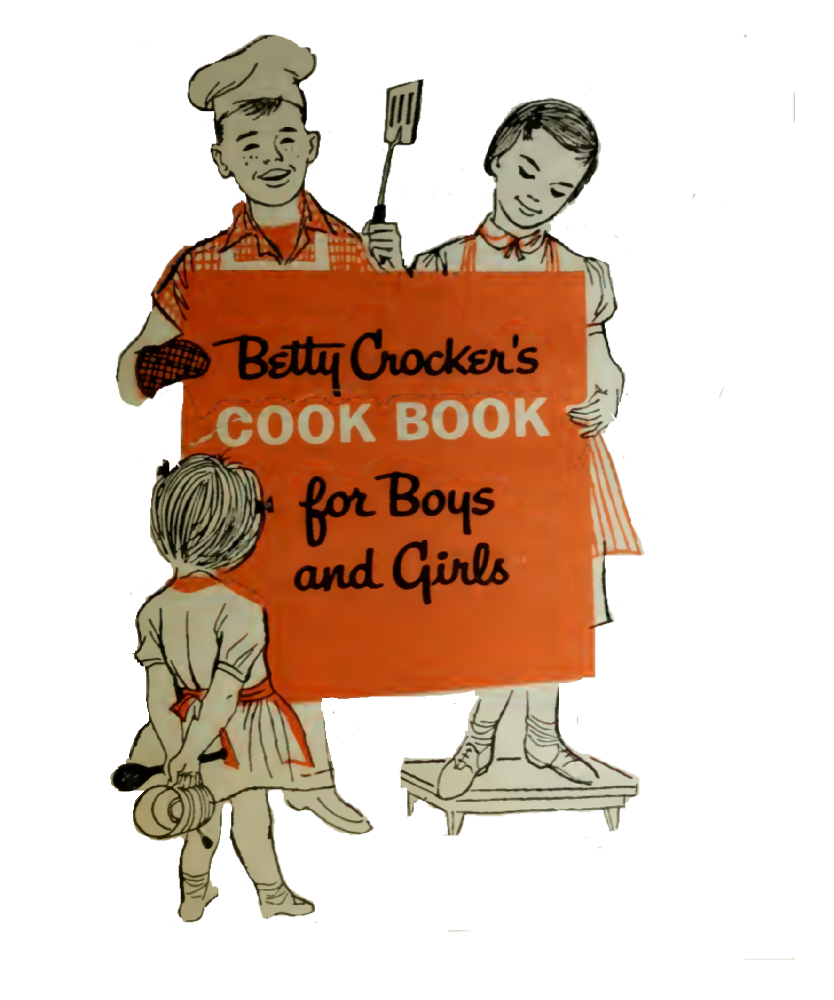
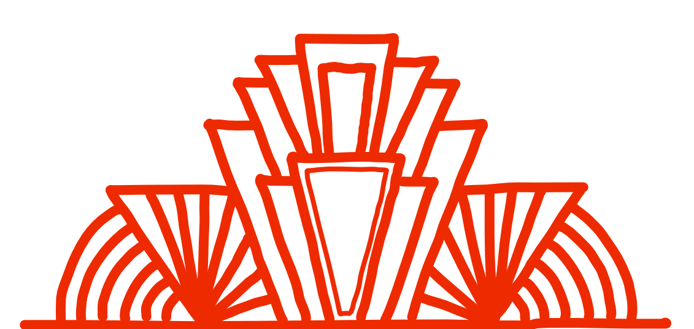
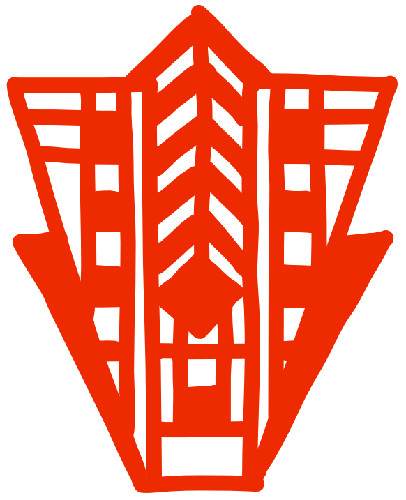
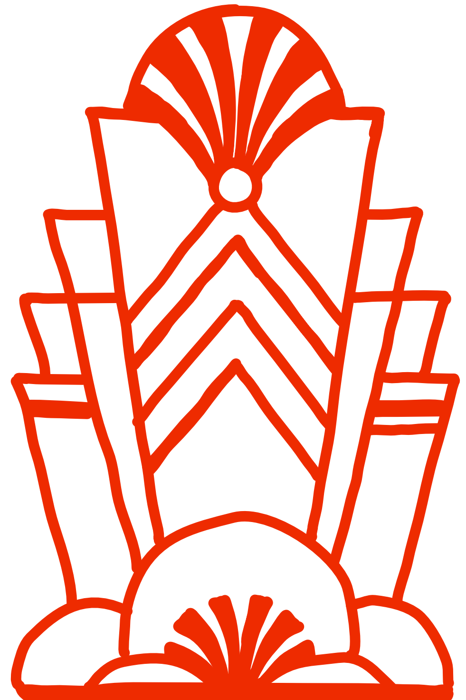

```{r setup, include=FALSE}
options(htmltools.dir.version = FALSE)
knitr::opts_chunk$set(highlight = TRUE)
```

```{r xaringan-themer, include=FALSE}
library(xaringanthemer)
mono_light(
  white_color = "#fff",
  header_font_google = google_font("Poiret One", "600"),
  text_font_google = google_font("Josefin Sans", "300", "300i"),
  code_font_google = google_font("Fira Code"),
  text_font_size = "24px",
  code_font_size = "1.2em"
)
opaque_box <- function(x) {
  htmltools::tags$div(
    class = "f1 bg-beige pa6 shadow-3 h-75 title-box",
    htmltools::tags$h1(htmltools::tags$em(x))
  )
}
```

class: hide-count, cover

.right-align[
# Starting an R Bookclub: Cooking up Friendships in Isolation
Maya Gans <br/>
<a href="https://twitter.com/Mayacelium">@Mayacelium</a><br/>
Slides: <a href="bit.ly/r4dsbookclub">bit.ly/r4dsbookclub</a>
]




---

class: center, middle, hide-count bkgimg
background-image: url(img/bkg-8.png)
background-size: cover

`r opaque_box("Developing a Dish")`

---

class: cover

---

class: center, middle, hide-count bkgimg
background-image: url(img/bkg-3.png)
background-size: cover

`r opaque_box("Essential Ingredients")`

---

class: cover

</img>
</img>

.essential-1[
# A Microcosm <br> in the Macrocosm
]

.essential-2[
# Async Compatible
]

---

class: center, middle, hide-count
background-image: url(img/bkg-4.png)
background-size: cover

`r opaque_box("Experimenting <br> with Flavors")`

---

class: cover

</img>
</img>
</img>

.experimenting-1[
#Reviewing
]

</img>

</img>
</img>
</img>

.experimenting-2[
#Creating
]

---

class: center, middle, hide-count
background-image: url(img/bkg-5.png)
background-size: cover

`r opaque_box("The Secret Sauce")`

---

class: cover

.sauce-1[
# Facilitator
]

</img>
</img>
    
.sauce-2[
#[Collaborative <br> Infrastructure](https://github.com/r4ds/bookclub-Advanced_R)
]

---

class: cover

.sauce-1[
# Facilitator
]

</img>
</img>
    
<a target="_blank" href="https://github.com/r4ds/bookclub-Advanced_R">
<div id="sauce-3"></div>
</a>
    
---

class: center, middle, hide-count
background-image: url(img/bkg-6.png)
background-size: cover

`r opaque_box("A Memorable Meal")`

---
class: cover

</img>
</img>
</img>

.wrapper-three[
  .little-wrapper[ 
    GitHub <br> Collaboration 
  ]
  .little-wrapper[ 
    RMarkdown <br> Skills 
  ]
  .little-wrapper[ 
    Presentation <br> Skills 
  ]
]

---

class: center, middle, hide-count
background-image: url(img/bkg-21.png)
background-size: cover

`r opaque_box("Copycat Recipe")`

---

class: cover

<div class="wrapper">
   </img>
  <div id="wrapper-inner">
    <div id="inner-content">8 WORLDWIDE COHORTS</div>
    <h1 style="color:#348B84;">DO IT YOURSELF!</h1>
    <a href="R4DS.io/join ">R4DS</a>
  </div>
</div>